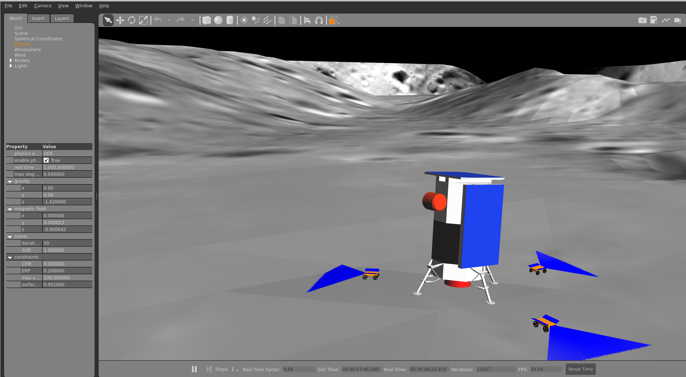

# NASA Space ROS Sim Summer Sprint Challenge


Image Credits: https://www.freelancer.com/contest/NASA-Space-ROS-Sim-Summer-Sprint-Challenge-2417552/details


Team Lead Freelancer Username: **SanjayJP02**

Submission Title: **CADRE Demo: Cooperative Autonomous Distributed Robotic Exploration**

 

# Package Description and Purpose

- This package simulates NASA’s CADRE mission, which focuses on mapping the Moon through a trio of autonomous rovers. The simulation is developed using ROS 2 and is part of NASA's lunar exploration initiative for Spring 2026.

  
  Image Credits: https://www.jpl.nasa.gov/missions/cadre

  


# The package consists of the following:


- **Lunar Landscape Design:**
  
1. Created a realistic lunar environment using Blender, based on publicly available lunar images from NASA’s gallery (https://science.nasa.gov/gallery/moon-images/).
2. Configured world parameters such as gravity, atmosphere, and pressure using data from NASA’s planetary factsheet for gazebo (https://nssdc.gsfc.nasa.gov/planetary/factsheet/moonfact.html).

 
   
- **CAD Model Development:**
  
1. Constructed the CAD model of the CADRE rover from scratch using images and information from NASA JPL’s website (https://www.jpl.nasa.gov/missions/cadre).
2. Implemented the model in SolidWorks and converted it to URDF format for use with ROS2 Humble.

     
   
- **Simulation and Integration:**
1. Integrated rover controls, IMU, LRF, and RGBD sensors for lunar mapping within the simulation.
2. Developed Python code to utilize point cloud data for mapping in relation to the Lander.

   
    
   
- **Teleoperation and Control:**
1. Created a Python GUI for teleoperation control of individual rovers, including camera visualization.
2. Set up ROS2 launch files to facilitate spawning multiple rovers as needed.

   
    
- **Cross-Platform Compatibility:**
1. Tested the simulation on Windows Subsystem for Linux (WSL) and VMware Linux, ensuring compatibility for developers who wish to avoid dual boot or having access to a Linux environment.
   
- **Open-sourced :**
1. Open-sourced SolidWorks CAD files and Blender files for additional changes. (https://github.com/Sanjay-j-p/demos/tree/main/CADRE_demo/CAD_and_Blender_files)


# Future Work:

- Implementing reinforcement learning for coordinated mapping and exploration in Gazebo.

# Definition and description of the public API


The CADRE rover topics:
- /clicked_point
- /clock
- /goal_pose
- /initialpose
- /parameter_events
- /performance_metrics
- /robot_1/cmd_vel
- /robot_1/joint_states
- /robot_1/odom
- /robot_1/robot_1_camera/camera_info
- /robot_1/robot_1_camera/depth/camera_info
- /robot_1/robot_1_camera/depth/image_raw
- /robot_1/robot_1_camera/depth/image_raw/compressed
- /robot_1/robot_1_camera/depth/image_raw/compressedDepth
- /robot_1/robot_1_camera/depth/image_raw/theora
- /robot_1/robot_1_camera/image_raw
- /robot_1/robot_1_camera/image_raw/compressed
- /robot_1/robot_1_camera/image_raw/compressedDepth
- /robot_1/robot_1_camera/image_raw/theora
- /robot_1/robot_1_camera/points
- /robot_1_front/scan
- /robot_1_imu/data
- /robot_1_robot_description
- /robot_2/cmd_vel
- /robot_2/joint_states
- /robot_2/odom
- /robot_2/robot_2_camera/camera_info
- /robot_2/robot_2_camera/depth/camera_info
- /robot_2/robot_2_camera/depth/image_raw
- /robot_2/robot_2_camera/depth/image_raw/compressed
- /robot_2/robot_2_camera/depth/image_raw/compressedDepth
- /robot_2/robot_2_camera/depth/image_raw/theora
- /robot_2/robot_2_camera/image_raw
- /robot_2/robot_2_camera/image_raw/compressed
- /robot_2/robot_2_camera/image_raw/compressedDepth
- /robot_2/robot_2_camera/image_raw/theora
- /robot_2/robot_2_camera/points
- /robot_2_front/scan
- /robot_2_imu/data
- /robot_2_robot_description
- /robot_3/cmd_vel
- /robot_3/joint_states
- /robot_3/odom
- /robot_3/robot_3_camera/camera_info
- /robot_3/robot_3_camera/depth/camera_info
- /robot_3/robot_3_camera/depth/image_raw
- /robot_3/robot_3_camera/depth/image_raw/compressed
- /robot_3/robot_3_camera/depth/image_raw/compressedDepth
- /robot_3/robot_3_camera/depth/image_raw/theora
- /robot_3/robot_3_camera/image_raw
- /robot_3/robot_3_camera/image_raw/compressed
- /robot_3/robot_3_camera/image_raw/compressedDepth
- /robot_3/robot_3_camera/image_raw/theora
- /robot_3/robot_3_camera/points
- /robot_3_front/scan
- /robot_3_imu/data
- /robot_3_robot_description
- /rosout
- /tf
- /tf_static


More Rovers can be added by using the following modification main.launch.xml:

'#' - numbers

Spawn coordinates[ x_,y_z_,roll_,pitch_yaw_]- location of the new rover

```xml
<include file="$(find-pkg-share robot_gazebo)/launch/spawn_with_control.launch.xml">
    <arg name="robot_name" value="robot_#"/>
    <arg name="robot_file" value="robot.xacro"/>
    <arg name="x_spawn" value="0.0"/>
    <arg name="y_spawn" value="0.0"/>
    <arg name="z_spawn" value="0.0"/>
    <arg name="roll_spawn" value="0.0"/>
    <arg name="pitch_spawn" value="0.0"/>
    <arg name="yaw_spawn" value="0.0"/>
</include>
```

# How to build and install

Follow these passages to build the docker image and start a docker container.

1. Clone this repository, change the directory to demos\CADRE_demo

2. Run the build script 
``````
chmod +x build.sh
./build.sh
``````

3. Start the container by executing

```
chmod +x run.sh
./run.sh
```

4. (optional) Additional terminals can be opened by executing
 ```
 chmod +x open_cmd.sh
 ./open_cmd.sh
 ```

5. **PLEASE MOVE THE MODELS [ Lunar and Luanr_lander ] to .gazebo/models in Home** (https://github.com/Sanjay-j-p/simulation/tree/main/models)

6.  **Please modify the locations in the robot.xacro for stl files. Rviz2 as Bug for not detecing Find package xml so i had to use hard location.**
 current"file:///home/ros2/multi_space_ros/src/robot_description/meshes/ .stl"
 ( https://github.com/Sanjay-j-p/demos/blob/main/CADRE_demo/robot_description/robot/robot.xacro)
   
## # CADRE simulation launch and run.

1. Source your ROS2 distribution. 
```
source /opt/ros/${ROS_DISTRO}/setup.bash
```

2. Build Your Workspace ex: CADRE_demo

```
cd ~/CADRE_demo/
colcon build --symlink-install
```
3. Source your workspace. 
```
source ~/CADRE_demo/install/setup.bash
```

4. Run the launch file.
```
ros2 launch robot_gazebo main.launch.xml
```
With this, will start the gazebo simulator and Rviz with the three CADRE rovers in the Lunar world.


# CADRE GUI teleopration.

In another terminal,

1. Excutable Premmsion for python files.
```cd ~/CADRE_demo/src/robot_control/scripts/
    chmod +x joy.py
    chmod +x mapping.py
```

 2. Run ```ros2 run robot_control joy.py```This will start GUI control for controlling individual Rovers.

# CADRE point clouds [ **Added only for one rover due to Hardware limit** ].

In another terminal, run ```ros2 run robot_control mapping.py```This will start the point cloud node and publish topics.


# License

Apache License 2.0
