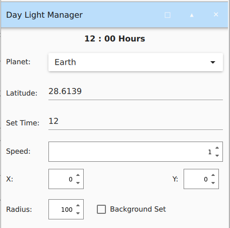

# Daylight Manager Plugin

The Sun plays a pivotal role in driving most planetary phenomena, influencing nearly every environmental aspect, directly or indirectly. Accurately modeling the Sun's path is essential for realistic environmental simulations, especially in complex scenarios.

The Daylight Manager plugin for Gazebo simulates the Sun's trajectory based on the time of day and the observer's latitude, providing a realistic and dynamic representation of sunlight. The shadow of object changes depending on the Sun's position, as depicted below

# Features:
1. Sun Trajectory Variation:

    - **Time of Day**: The Sun’s altitude changes throughout the day, and users can set a custom time to observe these variations.
    - **Latitude**: The observer's latitude influences solar altitude, and users can customize the latitude to adjust the Sun’s path accordingly. Below is an gif of the Sun's trajectory at -80° latitude on Earth. ( Right gif reference : https://andrewmarsh.com/apps/staging/sunpath3d.html )

2. **Live Time Update**: Real-time updates are displayed in the GUI.

3. **Adjustable Sun Position**: Users can modify the Sun's position with x and y offsets.

4. **Dynamic Lighting**: As the Sun's altitude changes, the simulation's background color dynamically adjusts to reflect different lighting conditions.

5. **Multi-Planet Support**: The plugin supports Sun trajectories for both Earth and Mars, allowing users to switch between them.

6. **Adjustable Rotation Radius**: The radius of the Sun's rotation can be modified using a radius spin box.

7. **Simulation Speed Control**: The Sun trajectory simulation speed can be accelerated up to 100x.

# GUI 

### Refs :
1. https://andrewmarsh.com/apps/staging/sunpath3d.html
2. https://ntrs.nasa.gov/api/citations/20200003207/downloads/20200003207.pdf
3. https://stackoverflow.com/questions/8708048/position-of-the-sun-given-time-of-day-latitude-and-longitude
4. https://ntrs.nasa.gov/api/citations/19940010257/downloads/19940010257.pdf
