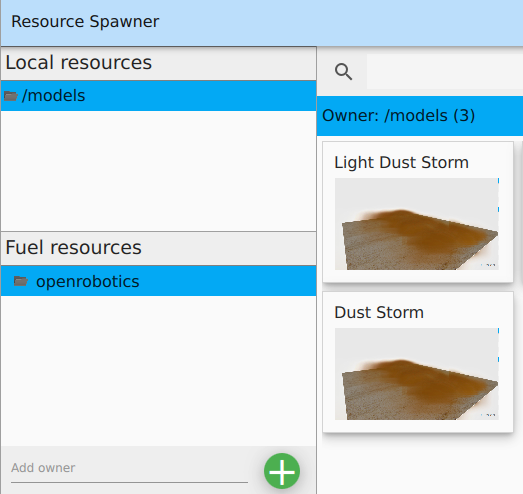
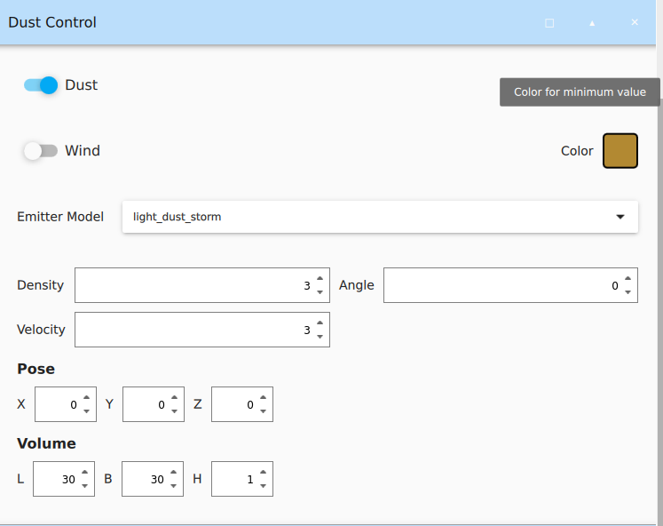

# Dust Manager Plugin

## Introduction
The Dust Manager plugin simulates realistic dust dynamics in Martian or space environments by controlling particle emitters. Dust is a significant factor in extraterrestrial conditions, particularly on Mars, where it can affect visibility, equipment performance, and overall mission success. This plugin allows for the accurate simulation of dust clouds, aiding in the development and testing of vehicles and systems designed for planetary exploration. By mimicking how dust interacts with moving objects, the plugin helps create more realistic and challenging simulation scenarios for space missions.
> The Dust Manager Plugin also provides feature to control the wind depending upon the paramters of the dust storms added in the simulation.

## Usage and Features

> As seen the in the image above, the dust is visable in the RGB camera and adds noise to the depth camera as well. Dust noise particles can also be seeen in the pointcloud data from the 3D lidar

### Color Change
You can change the color of the dust using the Dust Manager plugin GUI.
The color can be set the desired color or can be picked up from the screen.

### Dust Models
In order to spawn the dust model into the simulation, open the resource spawner plugin and search for Dust Storm models. There are 2 dust storm models available:
- Light Dust Storm: For light dust storm.
- Dust Storm: For heavy dust.

### Dust Manager GUI
The dust models are highly configurable using the dust manager GUI. In order to use the GUI, spawn the GUI from the top-right corner menu and spawn a dust storm model. The GUI will autmotically configure itself to the latest added dust storm model.
Various parameters of the dust storm can be configured such as:
- Toggle Dust: On/Off
- Toggle Wind: On/Off
- Select Dust Storm Model
- Control Density
- Control Volocity of dust particles
- Angle and Position of Dust Emitter
- Size of Dust Emitter

