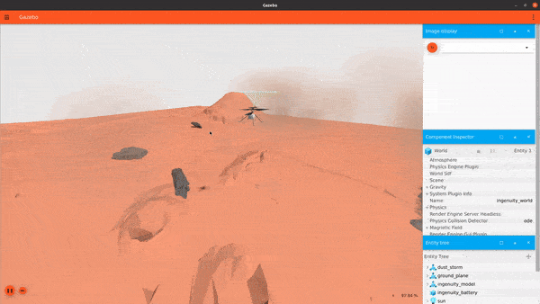
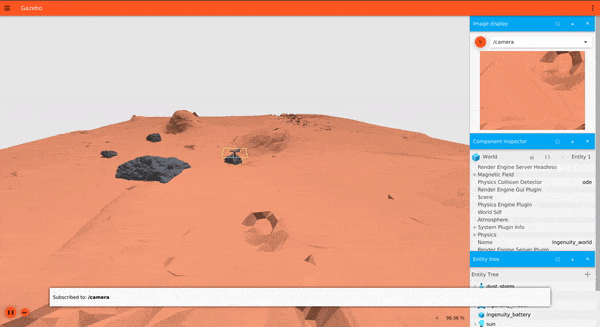
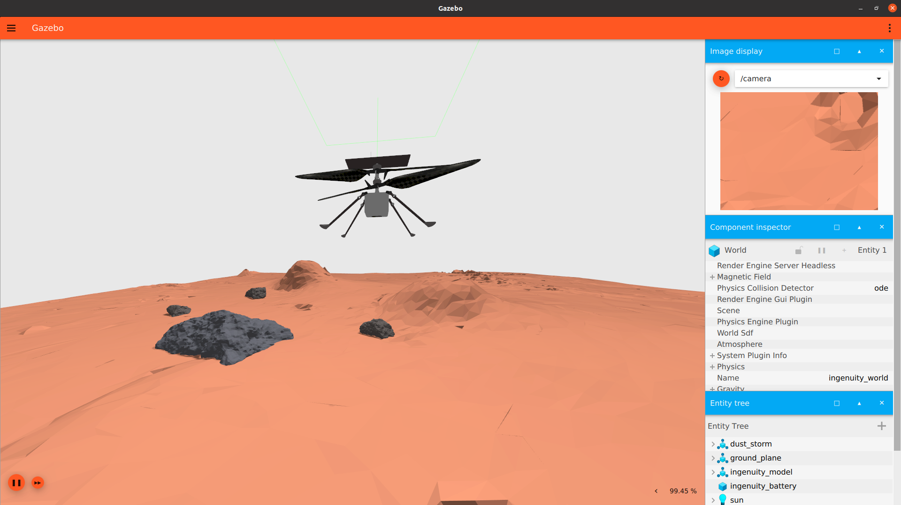
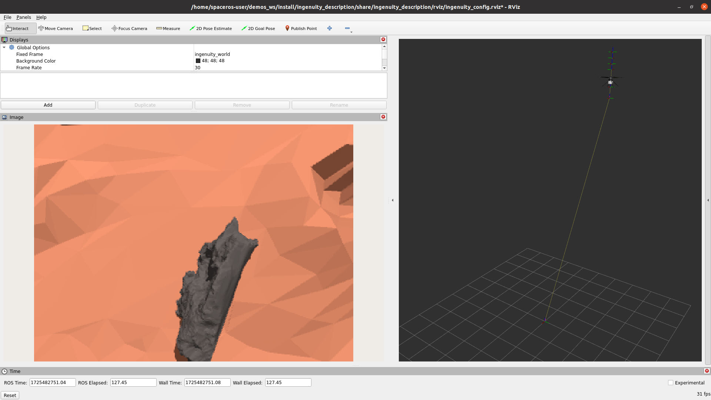
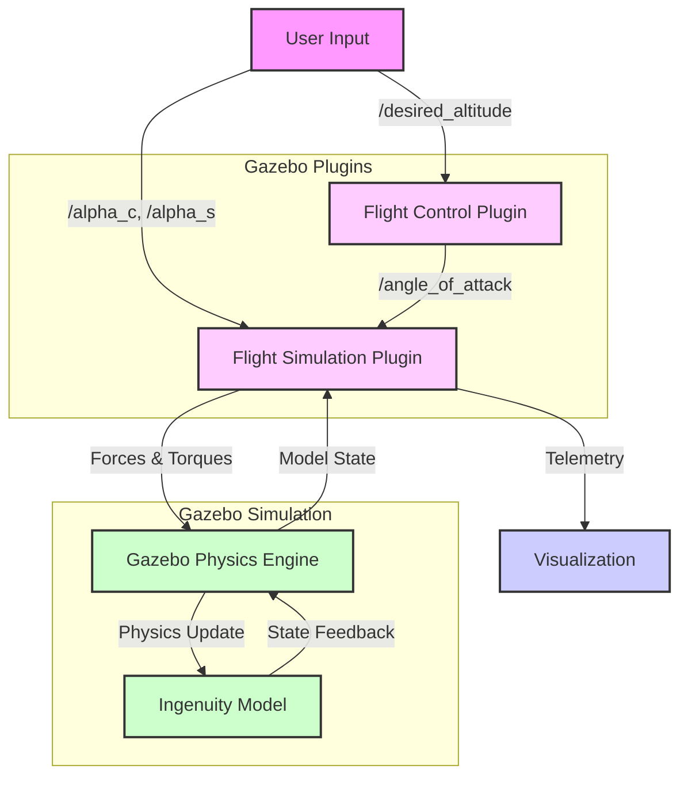

# NASA Space ROS Sim Summer Sprint Challenge
   Team lead freelance username: Barisyaz
   Submission title: Ingenuity Flight Simulator

# Ingenuity Flight Simulator

This project simulates the Ingenuity Mars Helicopter using Gazebo and ROS 2 in Space-ROS.

Aim of this project is to develop tools to mimic the Martian environment as close as possible. This enables space robots to easily iterate over the development cycles. This is important especially for the aerial vehicles. Because the air is much thinner and the nature events are different. Having this in mind, I develop the Ingenuity Flight Simulator, calculating the lift and drag forces as close to the Martian atmosphere and gravity as possible. This could enable Nasa engineers to develop controllers that can react to the nature events or test flight controllers with sensor noise such as IMU, altimeter or Camera.

## Structure

Each folder is a ROS 2 package. Each package has their own README.md file explaining the APIs and usage examples.

## Prerequisites

- Docker
- NVIDIA GPU (optional, but recommended for better performance)

## Setup

1. Clone this repository:
   ```bash
   git clone git@github.com:BarisYazici/demos.git
   git checkout feat/ingenuity-helicopter-simulation

   ```

2. Build the Ingenuity Flight Simulator image:
   ```bash
   cd ingenuity_flight_simulator
   ./build.sh
   ```

## Running the Simulation

First run the following to allow GUI passthrough:
```bash
xhost +local:docker
```

To start the simulation, run:
```bash
./run.sh
```

while the simulation is running in another terminal:

```bash
docker exec -it ingenuity_flight_simulator bash
```

to view all the topics coming from the simulator do:

```bash
ign topic -l
```

As an example you can subscribe to the /imu topic published from the ingenuity's body.

```bash
ign topic -et /imu
```


This will launch the Gazebo simulation with the Ingenuity model. Gazebo simulation GUI and RViz will pop up in new windows. By default, the Ingenuity's flight controller is activated and hovers the Martian helicopter to 10 meters of altitude.


## Contribution to Simulation and Control of Ingenuity

To control the ingenuity helicopter we need to change the angle of attack of the blade. There are two ways to change the angle of attack of the blades. First one is collective, this changes the angle of attack of the blades uniformly over the rotation of the blade. Collective control changes the altitude of the helicopter. Second way of control is cyclic control. This way we change the angle of attack interchangeably such that it creates different lift in different parts of the rotation. Cyclic control allows us to translate in x and y directions.

Ingenuity flight controller plugin implements a PID controller to change the collective to reach the desired altitude published as a gazebo ignition topic. This controller doesn't yet control the attitude of the helicopter.


## Demonstration

Here are some GIFs demonstrating the Ingenuity in action:


*Demonstrate mars dust storm*


*Take-off *


*Landing*


*Close up view of Ingenuity*


*RViz visualization integration*

## Architecture


Here's a diagram illustrating the architecture:



## Topics

The following table explains the key topics used in the Ingenuity Flight Simulator:

| Topic Name | Description | Data Type | Direction |
|------------|-------------|-----------|-----------|
| `/angle_of_attack` | Controls the collective pitch of the rotor blades | `ignition.msgs.Double` | Input to Simulation |
| `/alpha_c` | Lateral cyclic control input | `ignition.msgs.Double` | Input to Simulation |
| `/alpha_s` | Longitudinal cyclic control input | `ignition.msgs.Double` | Input to Simulation |
| `/desired_altitude` | Sets the target altitude for the flight controller | `ignition.msgs.Double` | Input to Controller |
| `/imu` | Provides IMU sensor data from the Ingenuity model | `ignition.msgs.IMU` | Output from Simulation |
| `/altimeter` | Provides altitude data from the Ingenuity model | `ignition.msgs.Altimeter` | Output from Simulation |
| `/camera` | Provides camera feed from the Ingenuity model | `ignition.msgs.Image` | Output from Simulation |
| `/wrench/ingenuity_model/blade_1` | Forces and torques applied to blade 1 | `ignition.msgs.Wrench` | Output from Simulation |
| `/wrench/ingenuity_model/blade_2` | Forces and torques applied to blade 2 | `ignition.msgs.Wrench` | Output from Simulation |
| `/wrench/ingenuity_model/blade_3` | Forces and torques applied to blade 3 | `ignition.msgs.Wrench` | Output from Simulation |
| `/wrench/ingenuity_model/blade_4` | Forces and torques applied to blade 4 | `ignition.msgs.Wrench` | Output from Simulation |


## License

Apache License 2.0
