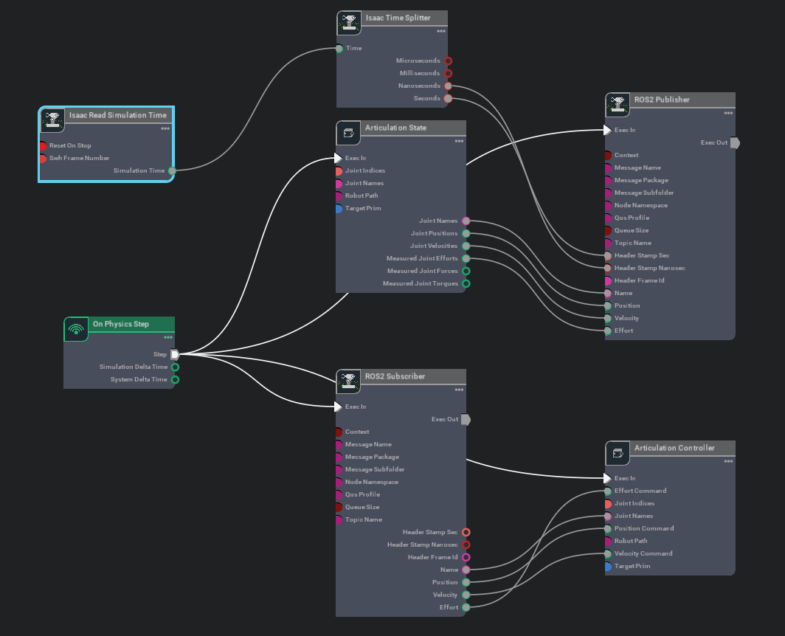

## Control Graph for Curiosity Mars Rover

The **Curiosity Mars Rover** is controlled using a combination of the **[ROS2 topic-based control plugin](https://github.com/PickNikRobotics/topic_based_ros2_control)** and an action graph specifically designed for managing the rover's components such as wheels, mast arm, and tool arm. This graph has been generated with help of this **[isaac_ros2_utils](https://github.com/hijimasa/isaac_ros2_utils)** package. Control system allows for seamless real-time control of the rover through ROS2 messages.

  

### ROS Topics for Control

Once the control graph is running, the following ROS2 topics are available for controlling the rover:

| Topic                                           | Description                                                                 |
|-------------------------------------------------|-----------------------------------------------------------------------------|
| `/cmd_vel`                                      | Controls the rover's linear and angular velocity.                           |
| `/curiosity_mars_rover/joint_command`           | Sends joint control commands for the articulated components of the rover.   |
| `/curiosity_mars_rover/joint_states`            | Publishes the current state (positions, velocities) of the rover's joints.  |
| `/arm_joint_trajectory_controller/joint_trajectory` | Commands the tool arm’s movement along a defined trajectory.                |
| `/arm_joint_trajectory_controller/state`        | Provides the current state of the tool arm trajectory controller. |
| `/mast_joint_trajectory_controller/joint_trajectory`| Commands the mast arm’s movement along a defined trajectory.                |
| `/mast_joint_trajectory_controller/state`       |Provides the current state of the mast arm trajectory controller. |
| `/dynamic_joint_states`                         |Publishes dynamic states of the rover’s joints (position, effort, velocity).|
| `/joint_states`                                 | Provides the current state of all joints (positions, velocities, efforts).  |
| `/steer_position_controller/joint_trajectory`   | Controls the steering of the rover's wheels.                                |
| `/wheel_tree_position_controller/commands`      | Sends position commands to the wheel controllers.                           |
| `/wheel_velocity_controller/commands`           | Sends velocity commands to the wheel controllers.                           |