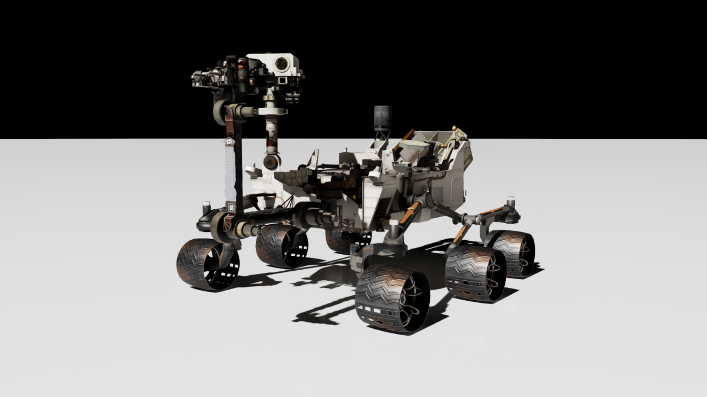

# Curiosity Mars Rover



The **Curiosity rover** is a car-sized robotic explorer that was launched by NASA in 2011 as part of the Mars Science Laboratory mission. Its primary mission is to investigate the climate and geology of Mars, particularly in the Gale Crater. Curiosity has been exploring the Martian surface since its landing in 2012, conducting experiments to determine whether Mars has ever had the conditions to support life. Equipped with advanced scientific instruments, Curiosity analyzes soil, rock samples, and the atmosphere, transmitting valuable data back to Earth. Its discoveries have helped scientists better understand the history of water on Mars and its potential to harbor life.

For more information, visit the official [NASA Curiosity Mars Rover mission page](https://science.nasa.gov/mission/msl-curiosity/).

### Model Overview

The **Curiosity rover** model used in this simulation is based on the original model from the [space-ros/simulation repository](https://github.com/space-ros/simulation). The original structure of the model has been preserved, with several modifications and enhancements added to optimize the rover's performance in the IsaacSim environment.

Key modifications include:

- **Drivers for joints**: Added control drivers for the rover's joints, allowing them to be controlled via ROS2.
- **Damping, stiffness, and joint friction**: Parameters were adjusted to ensure smooth and realistic movement of the rover, particularly for driving over rough terrain.
- **Spherical collision for wheels**: A spherical collision model was added to the wheels to optimize resource usage and ensure smooth traversal of complex landscapes.
- **Sensors**: All sensors, including the camera and lidar, were transferred with their original configurations from the URDF file to ensure accurate sensor performance in the simulation.

The model can be found in the project at the following path relative to the root folder:

```
/home/spaceros-user/curiosity_sim/models/curiosity_mars_rover/curiosity_mars_rover.usd
```

### Action Graphs

Several action graphs are used in the simulation to control different components of the rover and publish sensor data. These graphs are automatically generated when running Python scripts that open the corresponding simulation scenes and include:

1. **RobotControlGraph**: Manages the rover’s joints and sends control commands via ROS2.
2. **CameraGraph**: Controls the mast camera and publishes image data through ROS2.
3. **ClockGraph**: Publishes simulation time to the `/clock` ROS2 topic for synchronization.
4. **OdometryGraph**: Computes and publishes the rover’s odometry and transformations through ROS2.
5. **LidarGraph**: Processes and publishes data from the lidar sensor via ROS2.

### Available ROS Topics

When the simulation is running, the following ROS topics are available:

| Topic                                      | Message Type                | Description                                                                 |
|--------------------------------------------|-----------------------------|-----------------------------------------------------------------------------|
| `/clock`                                   | `rosgraph_msgs/Clock`        | Publishes the simulation time to synchronize with ROS nodes.                |
| `/curiosity_mars_rover/joint_command`      | `sensor_msgs/JointState`     | Receives joint control commands to manipulate the rover's joints.           |
| `/curiosity_mars_rover/joint_states`       | `sensor_msgs/JointState`     | Publishes the current states (position, velocity) of all the rover’s joints.|
| `/image_raw`                               | `sensor_msgs/Image`          | Provides the raw RGB image feed from the rover's camera.                    |
| `/model/curiosity_mars_rover/odometry`     | `nav_msgs/Odometry`          | Publishes odometry data, including the rover's position and velocity.       |
| `/scan`                                    | `sensor_msgs/LaserScan`      | Publishes lidar scan data to represent the rover's surrounding environment. |
| `/tf`                                      | `tf2_msgs/TFMessage`         | Provides the transformation between different coordinate frames of the rover.|

These topics allow you to control the rover, access sensor data, and monitor the simulation.