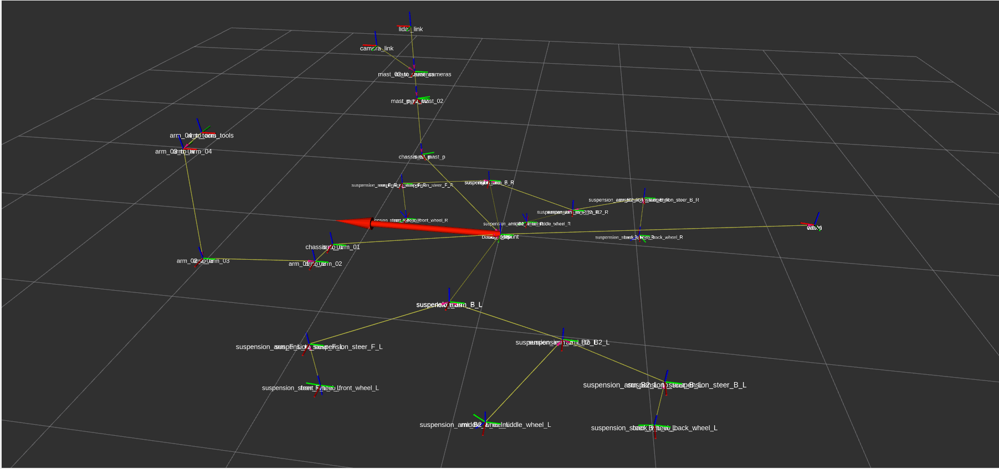
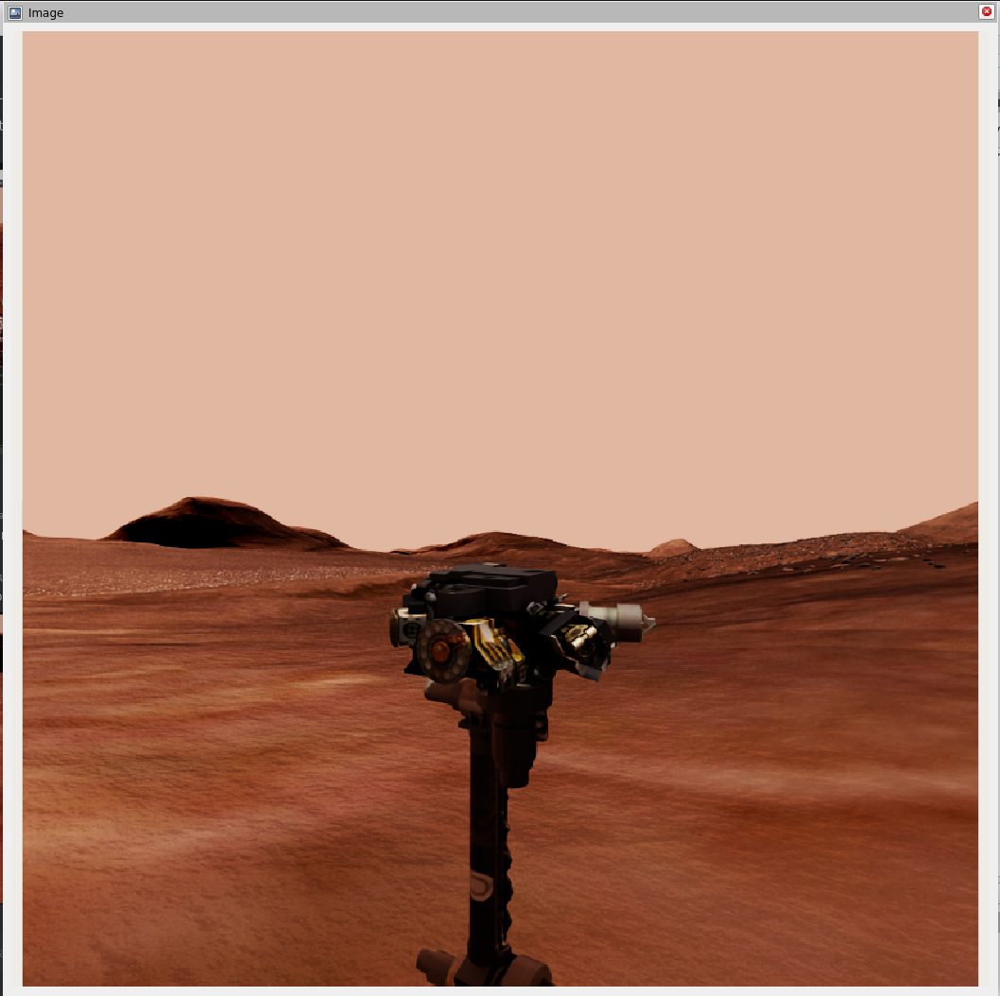
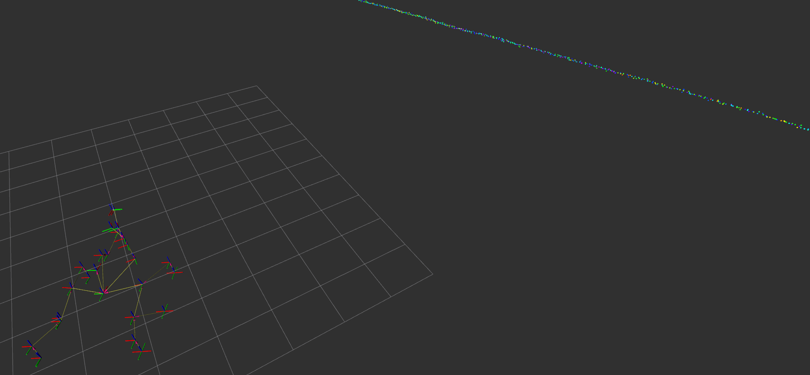

## Sensor Graphs for Curiosity Mars Rover

The **Curiosity Mars Rover** simulation includes several sensor setups, each managed by a specific ROS2 action graph. These sensors provide essential data such as the rover's position, orientation, and surrounding environment. The main sensor graphs are responsible for publishing TF, odometry, RGB camera data, and lidar data. The configurations for these sensors, including their positions and orientations, are derived from the original URDF file found in the [simulation repository](https://github.com/space-ros/simulation/tree/main/models/curiosity_path/urdf)

### TF and Odometry Publisher

This action graph is responsible for publishing both the **TF** (transformation) and **odometry** data. The graph reads the current position and orientation of the rover and publishes these values to the ROS2 network. The TF data is crucial for defining the relative positions of the rover's parts, while the odometry data provides information on the rover's movement over time.

<p align="center">
  
</p>

The configuration of the TF and odometry publishers is based on the data extracted from the URDF file. This ensures accurate and realistic simulation of the rover's position and movement within the environment.

If you need additional info about this part check [ROS2 Transform Trees and Odometry](https://docs.omniverse.nvidia.com/isaacsim/latest/ros2_tutorials/tutorial_ros2_tf.html)

### RGB Camera Publisher

This graph handles the **RGB camera** mounted on the rover's mast. The camera provides image data, which is published to the ROS2 network as an RGB image. This data can be used for tasks like computer vision, environment analysis, and remote monitoring.

<p align="center">
  
</p>

The placement and field of view for the camera are configured according to the URDF file. The camera graph captures frames from the simulation and publishes them as **sensor_msgs/Image** messages, allowing for further processing by ROS2 nodes.

For more information on setting up and using ROS2 cameras in IsaacSim, refer to the following guide:  
[ROS2 Camera Tutorial - IsaacSim](https://docs.omniverse.nvidia.com/isaacsim/latest/ros2_tutorials/tutorial_ros2_camera.html#isaac-sim-app-tutorial-ros2-camera)

### 2D Lidar Publisher

The **2D lidar** action graph is responsible for publishing point cloud data from the lidar sensor. Lidar is essential for mapping the rover's environment and detecting obstacles. The lidar configuration is imported through a **Docker volume** into the container and placed in the following path:

```
/usr/local/lib/python3.10/dist-packages/isaacsim/exts/omni.isaac.sensor/data/lidar_configs/CuriosityLidar.json
```

This file contains the specifications and settings for the Curiosity Rover's 2D lidar sensor.

<p align="center">
  
</p>

The 2D lidar sensor emits laser beams and collects data about distances to surrounding objects. This data is published in ROS2 **sensor_msgs/LaserScan** for use in mapping and obstacle detection. Config can be finded in this [folder](../lidar_configs/CuriosityLidar.json).

Also you can use this [script](../scripts/lidar_emmiters_gen.py) for your own config generation.

For more details on configuring and using RTX-based lidar in IsaacSim, check out these links:  
- [RTX Lidar Tutorial - IsaacSim](https://docs.omniverse.nvidia.com/isaacsim/latest/ros2_tutorials/tutorial_ros2_rtx_lidar.html)  
- [Lidar Configuration Guide - IsaacSim](https://docs.omniverse.nvidia.com/isaacsim/latest/features/sensors_simulation/isaac_sim_sensors_rtx_based_lidar/lidar_config.html)