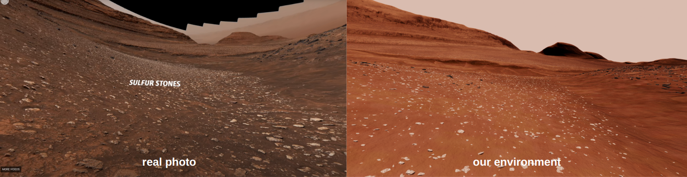
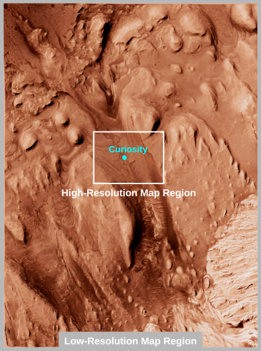
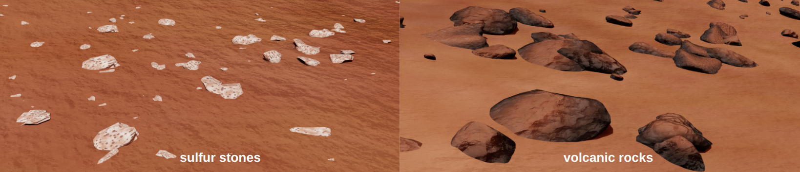

# Mars: Gale Crater - Gediz Vallis Channel Environment

## Curiosity's Sulfur Stone Discovery

NASA's Curiosity rover made a groundbreaking discovery on May 30, 2024 while exploring the Gediz Vallis channel within Gale Crater. Curiosity drove over and cracked open a white/yellow stone revealing it is made of pure-sulfer crystal. This is the first instance of elemental sulfur stone found on Mars. Curiosity encountered large fields of these bright stones. It drilled its #41 hole on a rock and took a 360-degree panoramic photo of the surrounding area.

See [NASA JPL's original post](https://www.jpl.nasa.gov/news/nasas-curiosity-rover-discovers-a-surprise-in-a-martian-rock) from July 31, 2024 for full-story.

Click on the image below to see the 360-degree panoramic photo taken by Curiosity (source: same post from above).  

## Digital Twin of Gediz Vallis Channel Environment

Using the 360-degree panoramic photo, [Curiosity's current location and trajectory](https://science.nasa.gov/mission/msl-curiosity/location-map/), and the [HIRISE Gediz Vallis Channel DTM](https://www.uahirise.org/dtm/dtm.php?ID=PSP_009149_1750), we successfully pinpointed Curiosity’s first sulfur stone discovery location within the DTM. To commemorate this historic discovery, we created a digital twin of the Gediz Vallis Channel, with a focus on accurately recreating the environment surrounding the sulfur stone discovery site.

  

## Map Setup

The original Gediz Vallis Channel map from DTM dataset spans approximately 5.65 km in width and 14 km in length, with a resolution of 1.01 meters per post. Using the entire map at the native resolution is too resource-intensive. As a result, the outer sections of the map were cropped to exclude areas too far from Curiosity's current location. The remaining region was divided into two sections: a high-resolution inner region, centered on the sulfur stone discovery site, with 60% of the original resolution (2.02 meters per post), and a low-resolution outer region at 10% of the original resolution, primarily serving as a background. The terrain's texture map were colorized to the generaic Mars color, upscaled, and post-processed to enhance detail. Certain parts of the terrain meshes, such as sand dunes or cliffs, were edited to enhence their geographic features.

  

## Environment Color

The terrain texture was colorized to the typical color of Mars. If you would like to alter the overall color theme of the environment (such as making it more red or yellow), it can be done by adjusting the distant light color in Isaac Sim without changing the terrain texture itself.

## Rocks

There are many different types of rock on Mars. Using the 360-degree panoramic photo taken at the sulfur stone discovery site and other publicly available Mars photos as references, we custom-designed two distinct types of rock assets: white/yellow sulfur stones and black volcanic rocks. Each rock type has unique characteristics:

- **Sulfur Stones**: Small, white/yellow rocks with surface holes
- **Volcanic Rocks**: Black, partially dust-covered stones

  

A total of 24 variations of sulfur stones and 20 variations of volcanic rocks were generated. The sulfur stones were made to be very low poly due to the large number being spawned. The rocks' shapes, materials, and textures were made to retain their unique properties. They were placed according to real-world reference photo, with randomized sizes and orientations. More type of rocks will be added in the future.

Most of the rocks in the Gediz Vallis Channel environment has collision enabled, allowing them to interact with Curiosity's wheels. However, some of the very smaller rocks do not have collision enabled, allowing the wheels to pass through them.