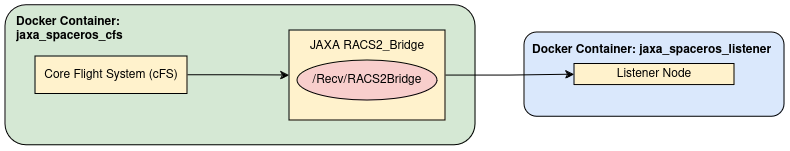

# JAXA RACS2 Bridge Demo

This demo demonstrates the use of the [RACS2](https://github.com/jaxa/racs2_bridge) (ROS and cFS System 2) Bridge to facilitate communication between {Space ROS](https://github.com/space-ros) and [Core Flight Executives (cFE)](https://github.com/nasa/cFE). The cFE is a core component of NASA-supplied spacecraft software, the [Core Flight System (CFS)](https://github.com/nasa/cFS). 

This code is a part of the following challenge:
- Challenge Name: NASA Space ROS Sim Summer Sprint Challenge 
- Team Lead Freelancer Username: minahilrz
- Submission Title: JAXA RACS2 Bridge Demo

## Directory Overview

- **jaxa_comm_spaceros**: A ROS2 package for communication over the bridge. This ROS2 package allows spawning listener nodes to receive messages over the RACS2 Bridge.
- **racs2_msg**: A ROS2 package containing message definitions for communication between ROS2 and cFS.
- **cFS_app_examples**: Example apps for cFS.
- **Dockerfile.jaxa_spaceros_cfs**: Dockerfile for building the `jaxa_spaceros_cfs` container. It uses the spaceros image as its base.
- **Dockerfile.jaxa_spaceros_listener**: Dockerfile for building the `jaxa_spaceros_listener` container. It uses the spaceros image as its base.
- **run_jaxa_spaceros_cfs.sh**: Script to run the `jaxa_spaceros_cfs` container.
- **run_jaxa_spaceros_listener.sh**: Script to run the `jaxa_spaceros_listener` container.
- **build.sh**: Script to build two Docker images: `jaxa_spaceros_listener` and `jaxa_spaceros_cfs`.


## Dependencies

To get started, ensure you have Docker Desktop installed on your system. This tutorial uses the Space ROS image, which can either be pulled from a registry or built locally.

## Build Instructions

To build the two necessary Docker containers, simply run the provided `build.sh` script:

```bash
./build.sh
```

Once completed, you will have two Docker images: **jaxa_spaceros_listener** and **jaxa_spaceros_cfs**.

## Usage Instructions
### Terminal 1: Start the cFS Container

To start the `jaxa_spaceros_cfs` container, run:
```bash
./run_jaxa_spaceros_cfs.sh
```

When the bash terminal for the container opens, execute the following commands to start the bridge nodes:
```bash
source install/setup.bash
ros2 run bridge_py_s bridge_py_s_node --ros-args --params-file ./src/bridge_py_s/config/params.yaml
```

### Terminal 2: Start the cFE Publisher
Connect to the same `jaxa_spaceros_cfs` container using
```bash
docker exec -it jaxa_spaceros_cfs bash
```

Now, run the following commands inside the container to send messages over the bridge:
```bash
cd ../cfs/build/exe/cpu1/
./core-cpu1
```

### Terminal 3: Start the Listener Node
The `jaxa_comm_spaceros` package provides different examples of listener nodes, including demos of interacting with the Curiosity Rover and Canadarm.

#### Example 1: Simple Listener Demo
In this example, a simple listener node is spawned which would receive the message and print it.

First, run the `jaxa_spaceros_listener` container using the following script:
```bash
./run_jaxa_spaceros_listener.sh
```

Then, run the following commands inside the container to start the listener node:
```bash
source install/setup.bash
ros2 run jaxa_comm_spaceros jaxa_simple_listener

```

#### Example 2: JAXA Bridge and Curiosity Rover Demo
In this example, the listener node receives numbers as messages from the cFS (commands) over the bridge and performs an action accordingly including moving and stopping the rover, turning the rover, opening and closing the tool arm or the mast.

You need to build the space_robots image or run the curiosity rover on your own machine prior to running this example by following the instructions in the [demos](https://github.com/space-ros/demos) and [docker](https://github.com/space-ros/docker/tree/main) repos.

Once you run the demo docker container, launch the demo using:
```bash
ros2 launch mars_rover mars_rover.launch.py
```

Then, run the `jaxa_spaceros_listener` container using the following script:
```bash
./run_jaxa_spaceros_listener.sh
```

Then, run the following commands inside the container to start the rover listener node:
```bash
source install/setup.bash
ros2 run jaxa_comm_spaceros jaxa_rover_listener

```

#### Example 3: JAXA Bridge and Canadarm Demo
In this example, the listener node receives numbers as messages from the cFS (commands) over the bridge and performs an action accordingly by calling services for the Canadarm.

Similar to example 2, you need to build the space_robots image or run the Canadarm demo on your own machine prior to running this example.

Once you run the demo docker container, launch the demo using:
```bash
ros2 launch canadarm canadarm.launch.py
```

Then, run the `jaxa_spaceros_listener` container using the following script:
```bash
./run_jaxa_spaceros_listener.sh
```

Then, run the following commands inside the container to start the canadarm listener node:
```bash
source install/setup.bash
ros2 run jaxa_comm_spaceros jaxa_canadarm_listener

```

## Architecture
The main design goal was to simulate a real life situation where the listener would be running pn a different machine as compared to the system running the cFS. Therefore, this demo builds and runs two separate containers. The system architecture is provided below.



## Using the jaxa_comm_package in other projects
The communication package can be used in any system which has ROS2 or SpaceROS installed. Copy the package files into your own workspace and use colcon to build it.

## Notes
- When running ROS nodes inside docker containers, all the containers must be over the same network.
- The listener node can be run in the same spaceros container as the bridge and cFS. Two separate containers demonstrate a scenario where different systems are communicating over the RACS2 Bridge.

