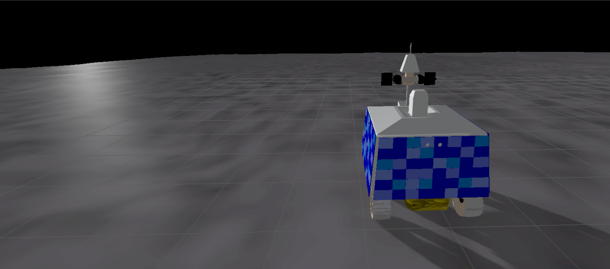
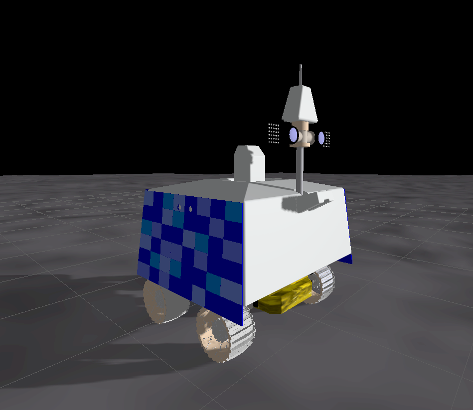
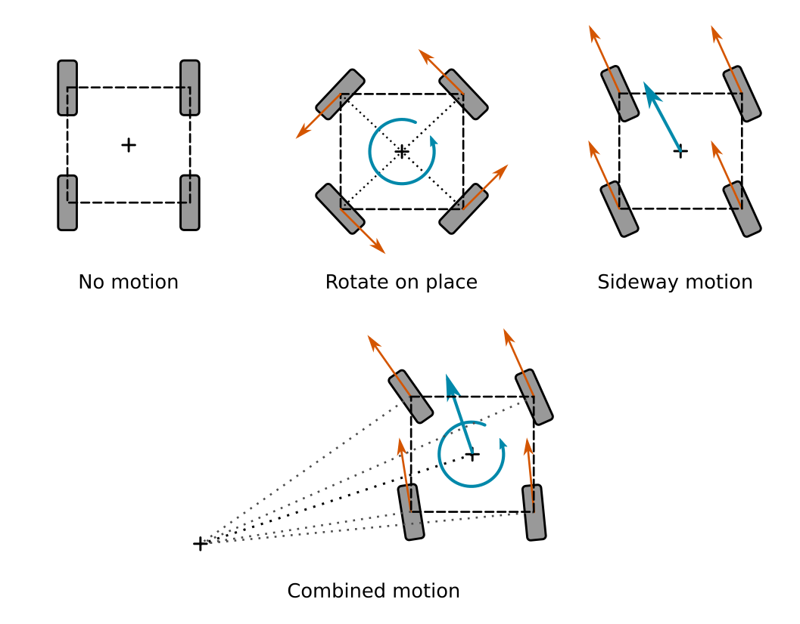
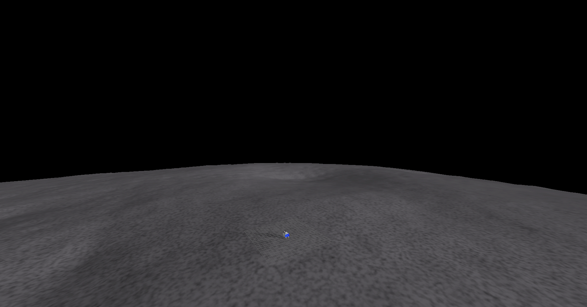
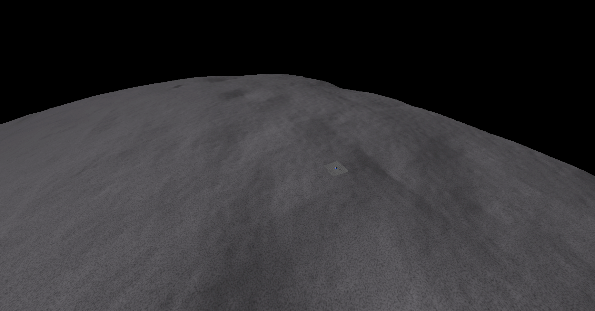
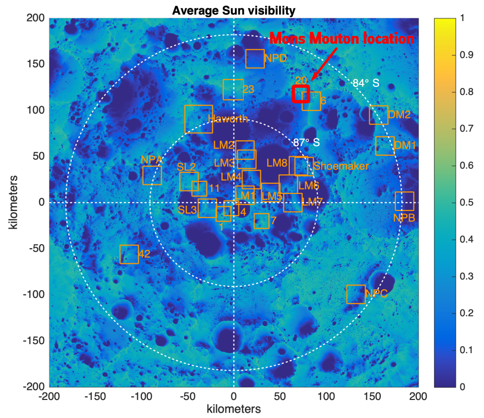
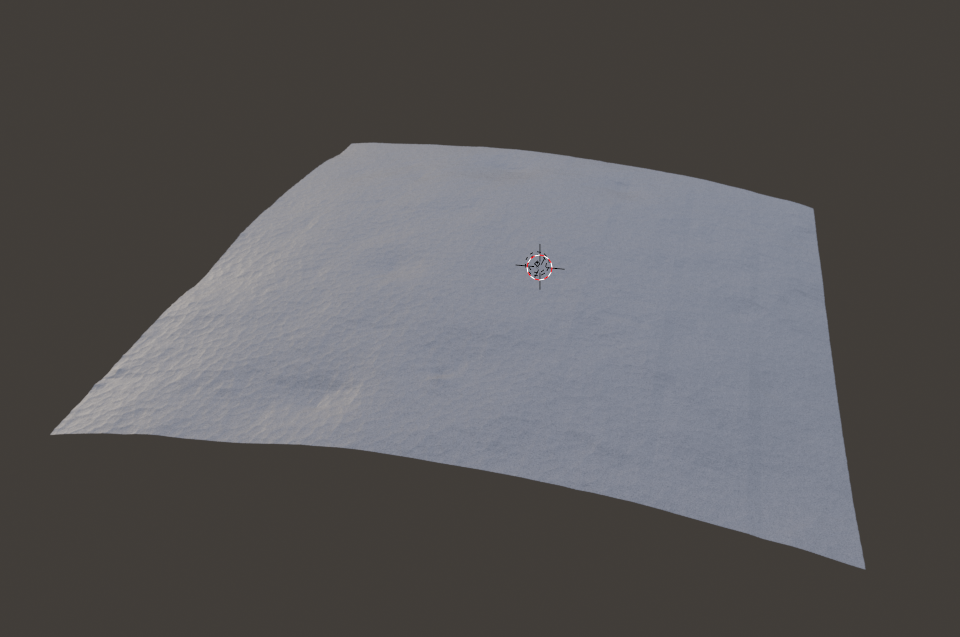

# lunar_pole_exploration_rover



This package (and associated assets in the simulation repository) provides a Gazebo simulation of a lunar south pole exploration mission inspired by the real NASA VIPER mission.

It includes a realistic environment, the Mons Mouton, where the VIPER rover was planned to land, and a fully controllable rover model. 

The key elements of the simulation is the integration of specifically developped Gazebo plugins. A solar panel plugin and associated battery and power consumption plugins aim to simulate the power generation challenge of the lunar south pole.

This package and associated plugins and models were developped by [Robin Baran](https://github.com/RBinsonB) and [Stevedan Ogochukwu Omodolor Omodia](https://github.com/stevedanomodolor) for the NASA Space ROS Sim Summer Sprint Challenge.

    Challenge Name: NASA Space ROS Sim Summer Sprint Challenge
    Team lead Freelancer name: @RBinson
    Submission title: Lunar Pole Exploration Rover & Plugins

# Table of contents
1. [Running the demo](#running_demo)
    1. [Building the docker](#building_docker)
    2. [Running the docker](#running_docker)
    3. [Controlling the rover](#controlling_rover)
        1. [Setup](#setup_rover)
        2. [Available commands](#available_commands)
    4. [Solar panel and power](#solar_panel_and_power)
2. [Contribution details](#contrib)
    1. [Why It Matters](#why_it_matters)
    2. [Lunar Pole Exploration Rover](#lunar_pole_exploration_rover)
        1. [Sensor suit](#sensor_suit)
        2. [Power system](#power_system)
        3. [Control node](#control_node)
            1. [Motion types](#motion_types)
        4. [Rover model API](#rover_api)
            1. [Subscribed Topics ](#sub_topics)
            2. [Published Topics](#pub_topics)
            3. [Services](#services)
            4. [Controllable Joint Interfaces](#control_joint_interfaces)
    3. [Mons Mouton World](#mons_mouton_world)
        1. [Mons Mouton Terrain Model](#mons_mouton_terrain_model)
    4. [Power System Plugins](#power_system_plugins)
        1. [SolarPanelPlugin](#solar_panel_plugin)
            1. [How to setup the plugin](#solar_panel_plugin_setup)
        2. [RadioisotopeThermalGeneratorPlugin](#rtg_plugin)
            1. [How to setup the plugin](#rtg_plugin_setup)
        3. [RechargeableBatteryPlugin](#bat_plugin)
            1. [How to setup the plugin](#bat_plugin_setup)
        4. [SensorPowerSystemPlugin](#sensor_system_plugin)
            1. [How to setup the plugin](#sensor_system_plugin_setup)

## Running the demo <a name="running_demo"></a>
### Building the docker <a name="building_docker"></a>
To build the docker image, go to the main folder of the lunar_pole_rover package and run:

```bash
./build.sh
```

The build process will take about 30 minutes, depending on the host computer.


### Running the docker <a name="running_docker"></a>
After building the image, you can see the newly-built image by running:

```bash
docker image list
```

The output will look something like this:

```
REPOSITORY              TAG                        IMAGE ID       CREATED        SIZE
openrobotics/moveit2    latest                     6edb2edc9643   10 hours ago   15.5GB
openrobotics/lunar_pole_exploration_rover_demo   latest                     629b13cf7b74   12 hours ago   7.8GB
nvidia/cudagl           11.4.1-devel-ubuntu20.04   336416dfcbba   1 week ago     5.35GB
```

The new image is named **openrobotics/lunar_pole_exploration_rover_demo:latest**.

There is a run.sh script provided for convenience that will run the spaceros image in a container.

```bash
./run.sh
```

To enable hardware acceleration, use run_gpu.sh (requires a docker install not from snap)*

```bash
./run_gpu.sh
```


Once the container is running, launch the demo by typing the following command:
```bash
ros2 launch lunar_pole_exploration_rover lunar_pole_exploration_rover.launch.py
```

### Controlling the rover <a name="controlling_rover"></a>
**Like the Curiosity demo, the Gazebo simulation may run slowly (reat-time factor of 5%) when simulating cameras if no hardware acceleration is present**

#### Setup <a name="setup_rover"></a>

Open a ne terminal and attach the current running container:
```bash
docker exec -it lunar_pole_exploration_rover bash
```

Source the necessary packaegs. 
```bash
source ~/spaceros/install/setup.bash
```

```bash
source ~/demos_ws/install/setup.bash
```

#### Available commands <a name="available_commands"></a>

```bash
ros2 service call /move_forward std_srvs/srv/Empty
```

Stop the rover

```bash
ros2 service call /move_stop std_srvs/srv/Empty
```

Turn left

```bash
ros2 service call /turn_left std_srvs/srv/Empty
```

Turn right

```bash
ros2 service call /turn_right std_srvs/srv/Empty
```

Rotate in place

```bash
ros2 service call /turn_right std_srvs/srv/Empty
```

Rotate the camera 

```bash
ros2 service call /camera_rotate std_srvs/srv/Empty
```

Center the camera

```bash
ros2 service call /camera_center std_srvs/srv/Empty
```

### Solar panel and power <a name="solar_panel_and_power"></a>
The power output of each panel can be printed by typing either of the following. When moving the rover, the power can be seen to vary as the panel position relative to the sun is changing.
```bash
ros2 topic echo /model/lunar_pole_exploration_rover/left_solar_panel/solar_panel_output
```
```bash
ros2 topic echo /model/lunar_pole_exploration_rover/right_solar_panel/solar_panel_output
```
```bash
ros2 topic echo /model/lunar_pole_exploration_rover/rear_solar_panel/solar_panel_output
```

The power being produced is sent to a rechargeable battery. The state of the battery can be seen using:
```bash
ros2 topic echo /model/lunar_pole_exploration_rover/battery/rechargeable_battery/state
```


## Contribution details <a name="contrib"></a>
Our contribution is as follows:
* A lunar south pole exploration Gazebo simulation modelled on NASA VIPER mission including:
  * A fully simulated rover model
  * A world and ground model to simulate the Mons Mouton (also called Liebnitz Beta) area.
* A set of Gazebo plugins to simulate power generation and consumption in space Robotics, used in the lunar pole exploration Gazebo simulation. These plugins are as follows:
  * A solar panel plugin to simulate power generation from the sun according to occlusion and angle between the sun and the panel
  * A radioisotope thermal generator plugin to simulate the constant power from a radioisotope thermal generator
  * A modified version of the linear battery plugin that is able to take as charge input the power outputs of the two previous plugins.
  * A sensor power load system plugin to simulate the power drawn by sensors

### Why It Matters <a name="why_it_matters"></a>
Our motivation and rational for this contribution is firstly based on the renewed global interest for the moon. The polar regions in particular are of high interest due to the high chance of water ice being present in permanently shaded craters. Said water could be used to establish a long lasting human presence on the moon (https://www.weforum.org/agenda/2023/08/space-water-ice-moon-south-pole/).

Unique challenges have to be addressed in this environment and would be interesting to simulate in Space-ROS. In particular the power generation and management:
* Solar power being constantly available outside of shaded area
* Solar power being unavailable while testing the presence of water ice in a shaded area
* Solar panel placement to adapt to the sun low position on the horizon

In addition, power generation and management strategies are a cornerstone of any space mission, and in particular space robotic missons. Many space missions have been saved or got extended beyond their initially planned lifetimes through the careful management of power loads. Deactivating science equipment, sensors and even actuators to reduce consumption. For example, the Opportunity and Spirit rovers extended their mission life well beyond the planned 90 days by deactivating non-essential equipment and reducing communication during dust storms (https://web.archive.org/web/20140902071407/http://www.nasa.gov/mission_pages/mer/mer-20070824.html). Being able to simulate those behaviors and strategies seems of great added value to Space-ROS.


### Lunar Pole Exploration Rover <a name="lunar_pole_exploration_rover"></a>
The rover gazebo model is designed to be as close as posible to the real NASA VIPER rover.

It has four steerable wheels that allow a wide range of motion, including going sideways [[source]](https://science.nasa.gov/mission/viper/in-depth/) (it would even be holonomic if it wasn't for the limits on the wheel steer angles).

The rover is equipped with a main navigation camera (actually a pair) mounted on a mast. The camera is able to pan and tilt.



The rover is powered by a battery. The battery capacity is estimated to be around 28,800Wh(960 Ah) assuming 300 w average consumption over 96 hours, the intended timeline of the mission. 
 The battery is charged by three solar panels: one on the left, one on the right and on at the back of the rover. The panels are tilted sideways to face the sun which is low on the horizon when close to the moon south pole. Total power of the solar panel is 450W [[source]](https://science.nasa.gov/mission/viper/in-depth/) and therefor each panel was estimated to produce 150W at full capacity (sun hitting horizontally). The solar panels are simulated using a specifically developed plugin, detailed later in the document.

#### Sensor suit <a name="sensor_suit"></a>
It features a similar sensor suit of the real VIPER rover. Detailed characteristics were obtained from [359199649_VIPER_Visible_Imaging_System](https://www.researchgate.net/publication/359199649_VIPER_Visible_Imaging_System) and [20210015009 - Colaprete-VIPER PIP final.pdf](https://ntrs.nasa.gov/api/citations/20210015009/downloads/20210015009%20-%20Colaprete-VIPER%20PIP%20final.pdf) and [viper-moon-rover-head-neck-mast-installed](https://www.space.com/viper-moon-rover-head-neck-mast-installed).
- A pair of monochrome cameras for navigation, NavCam, mounted on the rover mast. Each camera has 70° x 70° FOV and the image sensors have 2048 ×
2048 pixels. The camera can pan 360° and tilt vertically in both directions at a maximum angle of 75°.
- A pair of monochrome cameras for the aft blind spots, AftCam, facing back. Each camera has 110° x 110° FOV and the image sensors have 2048 ×
2048 pixels.
- A set of four monochrome cameras, on in each wheel well. Each camera has 110° x 110° FOV and the image sensors have 2048 ×
2048 pixels.
- An IMU.
- An Odometry plugin to simulate wheel encoders.

#### Power system <a name="power_system"></a>
The rover is powered by a simulated rechargeable battery. The battery is recharged by the solar panels and drained by the rover motion and sensors. A set of custom made Gazebo plugins is used to simulate this behavior. The plugins simulate the power generation depending on the sun position relative to the panels, the charge of the battery and the power of the sensors. Details on the plugins are given in the dedicated section later in the document.

#### Control node <a name="control_node"></a>
The `move_wheel` node provides the ROS2 standard `cmd_vel` control topic to drive the rover.
##### Motion types <a name="motion_types"></a>
The control nodes considers four different types of motion depending on the values of the field of the `cmd_vel` control topic.

* All fields to zero -- No motion
  All wheel steer angles are set to zero and all wheel velocities are set to zero. The rover will actively brake to stop.
* Only angular velocity around z-axis, no linear velocity -- Rotate on place
  The wheel steer angles are set individually so that they are all set perpendicularly to the robot center. The wheels will rotate accordingly for the rover to rotate on place at the request angular velocity
* Only linear velocity, no angular velocity -- Sideway motion
  The wheel steer angles are all set to the same angle, the angle of the linear velocity command vector. The wheels all rotates at the same velocities for the rover to move with the speed of the norm of the linear velocity command vector
* Linear velociies and angular velocity around z-axis -- Combined motion
  The rover will act as an Ackermann-driven robot. The sideway motion is first set as explained before by only considering the linear elements of the velocity command vector. The steer angle and rotation velocity of each wheel is then adjusted to add the angular velocity around z-axis by considering a steering radius for the robot.



#### Rover model API <a name="rover_api"></a>
##### Subscribed Topics  <a name="sub_topics"></a>
* **/cmd_vel** (`geometry_msgs/msg/Twist`) -- Velocity command to the rover
* **/model/lunar_pole_exploration_rover/sensor/aft_cam_left/activate** (`std_msgs/msg/Boolean`) -- Use to activate/deactivate the sensor and its associated power load
* **/model/lunar_pole_exploration_rover/sensor/aft_cam_right/activate** (`std_msgs/msg/Boolean`) -- Use to activate/deactivate the sensor and its associated power load
* **/model/lunar_pole_exploration_rover/sensor/nav_cam_left/activate** (`std_msgs/msg/Boolean`) -- Use to activate/deactivate the sensor and its associated power load
* **/model/lunar_pole_exploration_rover/sensor/nav_cam_right/activate** (`std_msgs/msg/Boolean`) -- Use to activate/deactivate the sensor and its associated power load
* **/model/lunar_pole_exploration_rover/sensor/haz_cam_left_front/activate** (`std_msgs/msg/Boolean`) -- Use to activate/deactivate the sensor and its associated power load
* **/model/lunar_pole_exploration_rover/sensor/haz_cam_right_front/activate** (`std_msgs/msg/Boolean`) -- Use to activate/deactivate the sensor and its associated power load
* **/model/lunar_pole_exploration_rover/sensor/haz_cam_left_rear/activate** (`std_msgs/msg/Boolean`) -- Use to activate/deactivate the sensor and its associated power load
* **/model/lunar_pole_exploration_rover/sensor/haz_cam_right_rear/activate** (`std_msgs/msg/Boolean`) -- Use to activate/deactivate the sensor and its associated power load

##### Published Topics <a name="pub_topics"></a>
* **/model/lunar_pole_exploration_rover/left_solar_panel/solar_panel_output** (`std_msgs/msg/Float32`) -- Publishes the current output of the left solar panel in watt
* **/model/lunar_pole_exploration_rover/right_solar_panel/solar_panel_output** (`std_msgs/msg/Float32`) -- Publishes the current output of the right solar panel in watt
* **/model/lunar_pole_exploration_rover/rear_solar_panel/solar_panel_output** (`std_msgs/msg/Float32`) -- Publishes the current output of the rear solar panel in watt
* **/model/lunar_pole_exploration_rover/odometry** (`nav_msgs/msg/Odometry`) -- Robot odometry
* **/model/lunar_pole_exploration_rover/odometry_with_covariance**(`nav_msgs/msg/OdometryWithCovariance`) -- Robot odometry
* **/model/lunar_pole_exploration_rover/battery/rechargeable_battery/state** (`sensor_msgs/msg/BatterySate`) -- Publishes the current state of the battery `rechargeable_battery´
* **/model/lunar_pole_exploration_rover/pose**(`geometry_msgs/msg/Pose`) -- Robot estimated pose from odometry
* **/model/lunar_pole_exploration_rover/battery/rechargeable_battery/total_power_supply**(`std_msgs/msg/Float32`) -- Total power supply from external power source to the battery `rechargeable_battery`
* **/model/lunar_pole_exploration_rover/battery/rechargeable_battery/total_power_consumption**(`std_msgs/msg/Float32`) -- Total power comsumed from the battery `rechargeable_battery`
* **aft_cam_left/camera_info** (`sensor_msgs/msg/CameraInfo`) -- AftCam left camera info
* **aft_cam_right/camera_info** (`sensor_msgs/msg/CameraInfo`) -- AftCam right camera info
* **nav_cam_left/camera_info** (`sensor_msgs/msg/CameraInfo`) -- NavCam left camera info
* **nav_cam_right/camera_info** (`sensor_msgs/msg/CameraInfo`) -- NavCam right camera info
* **haz_cam_left_front/camera_info** (`sensor_msgs/msg/CameraInfo`) -- HazCam left front camera info
* **haz_cam_left_rear/camera_info** (`sensor_msgs/msg/CameraInfo`) -- HazCam left rear camera info
* **haz_cam_right_front/camera_info** (`sensor_msgs/msg/CameraInfo`) -- HazCam right front camera info
* **haz_cam_right_rear/camera_info** (`sensor_msgs/msg/CameraInfo`) -- HazCam right rear camera info
* **aft_cam_left/image_raw** (`sensor_msgs/msg/Image`) -- AftCam left camera image
* **aft_cam_right/image_raw** (`sensor_msgs/msg/Image`) -- AftCam right camera image
* **nav_cam_left/image_raw** (`sensor_msgs/msg/Image`) -- NavCam left camera image
* **nav_cam_right/image_raw** (`sensor_msgs/msg/Image`) -- NavCam right camera image
* **haz_cam_left_front/image_raw** (`sensor_msgs/msg/Image`) -- HazCam left front camera image
* **haz_cam_left_rear/image_raw** (`sensor_msgs/msg/Image`) -- HazCam left rear camera image
* **haz_cam_right_front/image_raw** (`sensor_msgs/msg/Image`) -- HazCam right front camera image
* **haz_cam_right_rear/image_raw** (`sensor_msgs/msg/Image`) -- HazCam right rear camera image

##### Services <a name="services"></a>
* **camera_center** (`std_srvs/srv/Empty`) -- Demonstration service that center the pan of the camera and face down 45°
* **camera_rotate** (`std_srvs/srv/Empty`) -- Demonstration service that rotate the camera around
* **move_forward** (`std_srvs/srv/Empty`) -- Demonstration service that drive the rover forward
* **turn_left** (`std_srvs/srv/Empty`) -- Demonstration service that drive the rover forward and turn left
* **turn_right** (`std_srvs/srv/Empty`) -- Demonstration service that drive the rover forward and turn right
* **move_sideway_left** (`std_srvs/srv/Empty`) -- Demonstration service that drive the rover sideway to the left
* **move_sideway_right** (`std_srvs/srv/Empty`) -- Demonstration service that drive the rover sideway to the right
* **move_sideway_and_turn_left** (`std_srvs/srv/Empty`) -- Demonstration service that drive the rover sideway and rotate (combined motion)
* **move_stop** (`std_srvs/srv/Empty`) -- Demonstration service that stops the rover

##### Controllable Joint Interfaces <a name="control_joint_interfaces"></a>
* mast_head_pivot_joint (`revolute`) -- NavCam pan joint
* mast_camera_joint (`revolute`) -- NavCam tilt joint
* front_left_wheel_joint (`revolute`) -- front left wheel rotation joint
* rear_left_wheel_joint (`revolute`) -- rear left wheel rotation joint
* front_right_wheel_joint (`revolute`) -- front right wheel rotation joint
* rear_right_wheel_joint (`revolute`) -- rear right wheel rotation joint
* front_left_wheel_axle_joint (`revolute`) -- front left wheel steer joint
* rear_left_wheel_axle_joint (`revolute`) -- rear left wheel steer joint
* front_right_wheel_axle_joint (`revolute`) -- front right wheel steer joint
* rear_right_wheel_axle_joint (`revolute`) -- rear right wheel steer joint

### Mons Mouton World <a name="mons_mouton_world"></a>
A world and associated Gazebo terrain model for the Mons Mouton mountain located near the lunar south pole (also formaly refered to as Liebnitz Beta).




The differentiating characteristics of the Gazebo world are as follows:
* Gravity being set to lunar gravity (`<gravity>0 0 -1.62</gravity>`)
* Atmosphere being neglected (`<pressure>0.0</pressure>`)
* Sun light entity is placed low on the horizon and direction is set to mimic real sunlight conditions at Mons Mouton.

#### Mons Mouton Terrain Model <a name="mons_mouton_terrain_model"></a>
This model represents the 1sqkm area at Long31.00, Lat84.6 and was generated by using DEM data (site20) from the NASA LRO mission: https://pgda.gsfc.nasa.gov/products/78 (Barker, M.K., et al. (2021), Improved LOLA Elevation Maps for South Pole Landing Sites: Error Estimates and Their Impact on Illumination Conditions, Planetary & Space Science, Volume 203, 1 September 2021, 105119,  doi:10.1016/j.pss.2020.105119.).



The model was textured and additional detailed elevation noise at a higher definition than the DEM data was added.



### Power System Plugins <a name="power_system_plugins"></a>
#### SolarPanelPlugin <a name="solar_panel_plugin"></a>
The solar panel plugin allows to simulate solar panel power output depending on the panel orientation relative to the sun and LOS.

* Required elements
  * **link_name** (`str`) -- The solar panel link in the model
  * **nominal_power** (`float`) -- The maximum power supplied by the solar panel when the sun is hitting perdendicular

* Publications
  * **/model/`<model_name>`/`<link_name>`/solar_panel_output** (`std_msgs/msg/Float`) -- Publishes the current solar panel output in watt.
 
##### How to setup the plugin <a name="solar_panel_plugin_setup"></a>

The plugin needs to be attached to a model. The link specified by **<link_name>** is the solar panel.


```XML
<plugin filename="libSolarPanelPlugin.so" name="simulation/SolarPanelPlugin">
    <link_name>rear_solar_panel</link_name>
    <nominal_power>150.0</nominal_power>
 </plugin>
```
        
- The solar panel link needs to have a visual element. The power output is calculated by using the Z-axis of the solar panel link (Z-axis is considered the normal axis to the solar panel).
- **Important**: Some URDF parsers lump together links with fixed joints. To ensure the plugin is working correctly, it might be necessary for the solar panel link to be joined with a dynamic type of joint (and by setting the limits to zero if no motion is required). Example below:

  ```XML
  <joint name="solar_panel_joint" type="revolute">
      <parent link="body"/>
      <child link="solar_panel"/>
      <origin xyz="0.0252 0.7253 0.3829" rpy="1.4673 0 ${-PI}"/>
      <axis xyz="0 0 1"/>
      <limit lower="0.0" upper="0.0" effort="1e10" velocity="0.0"/>
  </joint>
  ```
- The plugin need a sun entity in the world. The sun needs to be a `light` entity of type `directional` with the name `sun`. The element `<pose>` and `<direction>` of the sun are used by the plugin and need to be set properly. Example below:
  ```XML
  <light type="directional" name="sun">
      <cast_shadows>true</cast_shadows>
      <pose>-2000 2000 100 0 0 0</pose>
      <diffuse>0.8 0.8 0.8 1</diffuse>
      <specular>0.2 0.2 0.2 1</specular>
      <intensity>1.5</intensity>
      <attenuation>
          <range>100000000</range>
          <constant>1.0</constant>
          <linear>0.0</linear>
          <quadratic>0.001</quadratic>
      </attenuation>
      <direction>0.9 -0.9 -0.2</direction>
  </light>
  ```
- **LOS (Line-Of-Sight)**: If the sun is occulted, no power is supplied by the solar panel plugin. To know if the panel is occulted, the plugin checks the line of sight between the `sun` (by using the `<pose>` element) and the link visual children. The panel solar link needs to have at least one visual element for the plugin to work.
- **Power computation**: The plugin computes the power generated by the panel by checking the angle between the Z-axis of the solar panel link and the `direction` vector of the sun according to the [cosine effect](https://www.e-education.psu.edu/eme812/node/896). The value given by nominal_power is multiplied by the result of the cosine of the angle between the sun direction vector and the solar panel z-axis.

#### RadioisotopeThermalGeneratorPlugin <a name="rtg_plugin"></a>

The radioisotope thermal generator plugin allows to simulate an RTG power output. It provides a constant power supply.

* Required elements
  * **link_name** (`str`) -- The RTG link in the model
  * **nominal_power** (`float`) -- The constant power in watt generated by the RTG.

* Publications
  * **/model/`<model_name>`/`<link_name>`/radioisotope_thermal_generator_output** (`std_msgs/msg/Float`) -- Publishes the current solar panel output in watt.

##### How to setup the plugin <a name="rtg_plugin_setup"></a>

The plugin needs to be attached to a model. Example below:

```XML
<plugin filename="libRadioisotopeThermalGeneratorPlugin.so" name="simulation/RadioisotopeThermalGeneratorPlugin">
    <link_name>chassis</link_name>
    <nominal_power>100.0</nominal_power>
</plugin>
```

#### RechargeableBatteryPlugin <a name="bat_plugin"></a>

The rechargeable battery plugin is a modified version of the stock LinearBatteryPlugin to allow recharge at a variable rate. It can be charged by any plugin providing a power output in watts on a Gazebo topic. In addition, by default, if no start draining topic is defined, the battery starts to drain as soon as the robot starts to move. 

* Required elements
  * **battery_name** (`str`) -- Unique name for the battery (required)
  * **voltage** (`double`) -- Initial voltage of the battery (required)
  * **open_circuit_voltage** (`double`) -- 
  * **open_circuit_voltage_constant_coef** (`double`) -- Voltage at full charge
  * **open_circuit_voltage_linear_coef** (`double`) -- Amount of voltage decrease when no charge
  * **initial_charge** (`double`) -- Initial charge of the battery in Ah
  * **capacity** (`double`) -- Total charge that the battery in Ah
  * **resistance** (`double`) -- Internal resistance in Ohm
  * **smooth_current_tau** (`double`) -- Coefficient for smoothing current [0, 1]
  * **power_source** (`array[str]`) -- List of topic of power sources.
  * **start_draining** (`boolean`) -- Whether to start draining the battery
  * **power_draining_topic** (`str`) -- This is the topic to start draining the battery
  * **stop_power_draining_topic** (`str`) -- This is to stop draining the battery
  * **power_load** (`double`) -- Idle power load
 
 * Publications
   * **/model/`<model_name>`/battery/`<battery_name>`/state** (`sensor_msgs/msg/BatterySate`) -- Publishes the current state of the battery

##### How to setup the plugin <a name="bat_plugin_setup"></a>
The plugin needs to be attached to a model. Example below:

```XML
<plugin filename="libRechargeableBatteryPlugin.so" name="simulation/RechargeableBatteryPlugin">
    <battery_name>rechargeable_battery</battery_name>
    <voltage>30.0</voltage>
    <open_circuit_voltage>30.0</open_circuit_voltage>
    <open_circuit_voltage_constant_coef>30.0</open_circuit_voltage_constant_coef>
    <open_circuit_voltage_linear_coef>-3.0</open_circuit_voltage_linear_coef>
    <initial_charge>9.0</initial_charge>
    <capacity>10.0</capacity>
    <resistance>0.1</resistance>
    <smooth_current_tau>1.0</smooth_current_tau>

    <!-- power source -->
    <power_source>left_solar_panel/solar_panel_output</power_source>
    <power_source>right_solar_panel/solar_panel_output</power_source>
    <power_source>rtg_body/radioisotope_thermal_generator_output</power_source>

    <power_load>11.0</power_load>
    <power_draining_topic>/battery/discharge</power_draining_topic>
</plugin>
```

* The power source topic needs to be on the format `<link_name>/<plugin_power_output_name>`. As of now, the following plugins can provide power to charge the battery:
  * **SolarPanelPlugin**: with topic `<link_name>/solar_panel_output`
  * **RadioisotopeThermalGeneratorPlugin**: with topic `<link_name>/radioisotope_thermal_generator_output`

#### SensorPowerSystemPlugin <a name="sensor_system_plugin"></a>
The sensor power system plugin pairs with the RechargeableBatteryPlugin allowing one to define for each sensor the power load it consumes from any battery in the model. Sensors can be deactivated to save power (as it is often the case on real space missions). When the battery is too low, the sensors managed by the plugin will also be deactivated. In addition, topics are exposed to disable the power load of each sensor consumption on demand. The topic uses the following format. 

 * **/model/`<model_name>`/sensor/`<sensor_name>`/activate** (`std_msgs/msg/Boolean`) -- Topic available to activate/deactivate the power consumption of sensor.
 * **/model/`<model_name>`/battery/`<battery_name`>/total_power_supply**(`std_msgs/msg/Float32`) -- Total power supply from external power source to the battery
 * **/model/`<model_name>`/battery/`<battery_name`>/total_power_consumption**(`std_msgs/msg/Float32`) --  Total power comsumed from the battery

The model can have multiple batteries and each sensor consumes from any of those batteries. 

#### How to setup the plugin <a name="sensor_system_plugin_setup"></a>
The plugin needs to be attached to a model. Example below:

```XML
 <plugin filename="libSensorPowerSystemPlugin.so" name="simulation/SensorPowerSystemPlugin">
 </plugin>
```

In addition, you need to include in each of the sensors, the power load and the battery they consume from. Example below:

```XML
 <gazebo reference="nav_camera_link_left">
    <sensor type="camera" name="NavCam_left">
        <visualize>1</visualize>
        <update_rate>10.0</update_rate>
        <power_load>11.0</power_load>
        <battery_name>rechargeable_battery</battery_name>
        <camera>
            <pose>1.0 0 0 0 0 0</pose>
            <horizontal_fov>1.22173</horizontal_fov>
            <image>
                <width>2048</width>
                <height>2048</height>
                <format>L16</format>
            </image>
            <clip>
                <near>0.01</near>
                <far>100</far>
            </clip>
            <noise>
                <type>gaussian</type>
                <stddev>0.007</stddev>
            </noise>
        </camera>
        <always_on>1</always_on>
        <topic>navcam_left/image_raw</topic>
    </sensor>
</gazebo>
```
