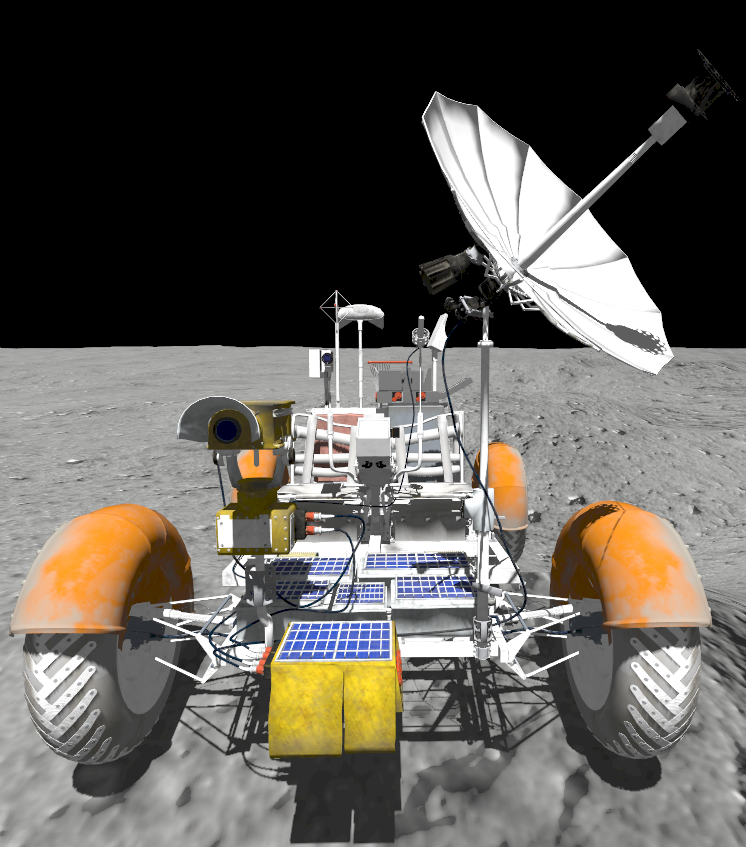
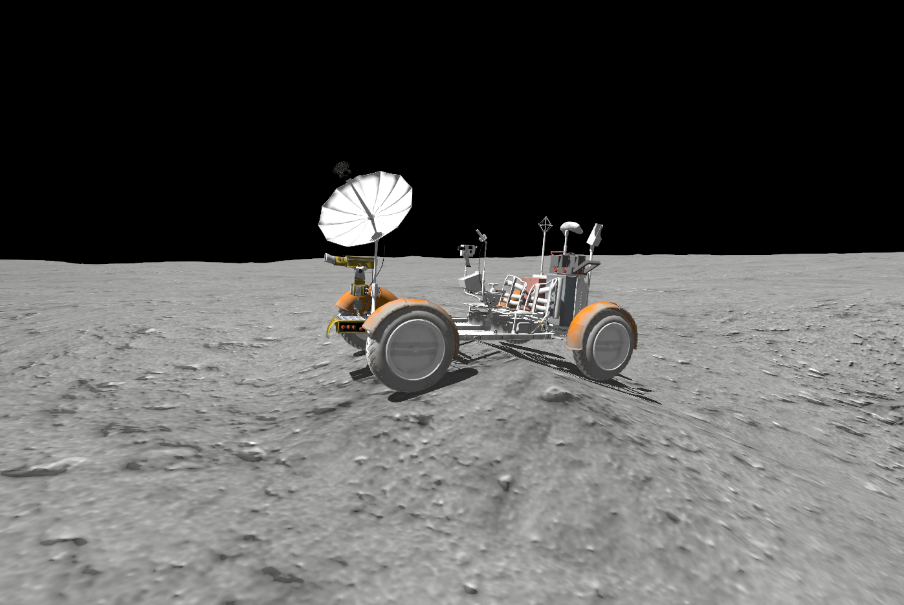

# Lunar Rover
This package provides a simulation of the Apollo 15 Lunar Roving Vehicle navigating the Apollo 15 landing site. Included is an Ackermann steering model for the rover, along with a simple proportional controller for steering. The rover is also equipped with two cameras and an IMU.





This package was created by Jasper Grant, as part of the NASA Space ROS Summer Sprint Challenge 2024.

This package can be run with the existing 'space_robots' docker image.

## Starting the Simulation

To start the simulation, run the following command:

```bash
ros2 launch lunar_rover lunar_rover.launch.py
```

To drive the rover using teleop, run the following command in a new terminal:

```bash
ros2 run teleop_twist_keyboard teleop_twist_keyboard
```

To start the vehicle's proportional controller driving in a square, run the following command in a new terminal:

```bash
ros2 run lunar_rover waypoints.py
```

## Topics

| Topic | Message Type | Description |
|-------|--------------|-------------|
| /model/lunar_roving_vehicle/odometry | nav_msgs/Odometry | The odometry data from the rover |
| /imu | sensor_msgs/Imu | The IMU data from the rover |
| /cmd_vel | geometry_msgs/Twist | The velocity command for the rover |
| /img_raw_front | sensor_msgs/Image | The raw image data from the front camera |
| /img_raw_handheld | sensor_msgs/Image | The raw image data from the handheld camera |