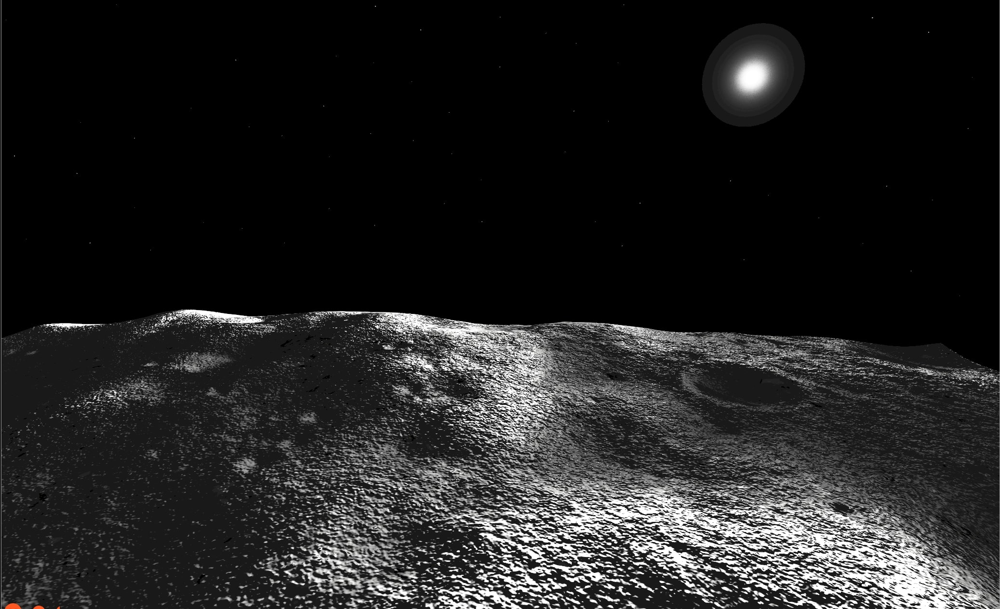

# Lunar Terrain Demo
[](https://opensource.org/licenses/Apache-2.0)\


This folder contains three ROS2 packages to enable simulation in a lunar environment, including a lunar gazebo world using a Digital Elevation Model (DEM) and a plugin for a dynamic sun model based on Ephemeris data.

# Space ROS Lunar Terrain Demo Docker Image

The Space ROS Lunar Terrain Demo docker image uses the spaceros docker image (*osrf/space-ros:latest*) as its base image.
The Dockerfile installs all of the prerequisite system dependencies along with the demo source code, then builds the Space ROS Lunar Sim Demo.

This demo includes a Gazebo simulation of the lunar environment (specfically around the Shackleton crater near the south pole). It uses
Digital Elevation Models (DEMs) from the Lunar Orbiter Laser Altimeter (LOLA) to accurately simulate the lunar surface in a specific region. It also contains a dynamic model of the Sun that moves according to Ephemeris data.  

## Building the Demo Docker

The demo image builds on top of the `spaceros` image.
To build the docker image, first ensure the `spaceros` base image is available either by [building it locally](https://github.com/space-ros/space-ros) or pulling it.

Then build `lunar_terrain` demo images:

```bash
cd lunar_terrain
./build.sh
```

## Running the Demo Docker

run the following to allow GUI passthrough:
```bash
xhost +local:docker
```

Then run:

```bash
./run.sh
```

Depending on the host computer, you might need to remove the ```--gpus all``` flag in ```run.sh```, which uses your GPUs.

## Running the Demo

Launch the demo:

```bash
source install/setup.bash
ros2 launch lunar_terrain_gz_bringup lunar_terrain_world.launch.py
```

This will launch the gazebo lunar world, spawn the rover and start teleop. This will be a new terminal window which enables you to control the rover as per the instructions in the terminal window.


## lunar_sun_gz_plugin
This package contains a gazebo plugin to move an actor and create a light source at the location of the actor. 
The plugin must be added to an actor named `animated_sun`, which can be done as follows:
```
<actor name="animated_sun">
    <plugin name="LunarSun" filename="liblunar_sun_gz_plugin.so"/>
    Other tags ...
</actor>
```
The suns trajectory is based on the `horizons_az_el.csv` file. Detailed documentation on updating this can be found on the space-ros lunar_terrain docs page.

You can adjust the sun’s position update frequency, which currently occurs every hour, by modifying the waypoint_duration variable in lunar_sun.cpp:
```
  std::chrono::_V2::steady_clock::duration waypointDuration =
    std::chrono::hours(1);
```

## lunar_terrain_gz_worlds
This package contains the lunar_terrain world files, including the world sdf, DEM files, textures and tools for creating textures. It also contains the `display.launch.py` launch file, which launches gazebo with the lunar_terrain world by default (but does not spawn the rover). For detailed documentation on updating DEM model and textures see the space-ros lunar_terrain docs page.

## lunar_terrain_gz_bringup
This package contains launch and configuration files to launch the lunar_terrain world and spawn [leo_rover](https://github.com/LeoRover) with keyboard controls. The `spawn_leo_robot.launch.py` spawns the leo model, starts`gz_bridge` and `key_teleop`. The `gz_bridge` parameters can be modified in the `leo_ros_gz_bridge.yaml` file in the config directory.

Challenge Name: NASA Space ROS Sim Summer Sprint Challenge \
Team Lead Freelancer Username: elementrobotics \
Submission Title: LunarSim