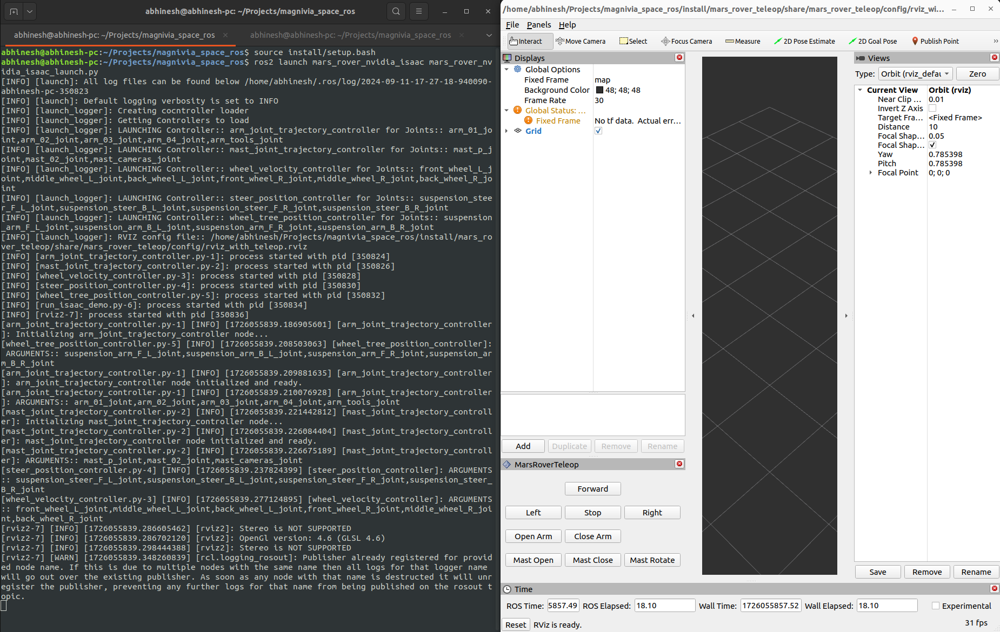

# Mars Rover Demo for Nvidia ISAAC

This pacakge reconfigures the controllers implemented in **mars_rover** package into separate controllers and adds a controller loader to load the configuration from the **config > isaac_mars_rover_control.yaml** file in the config folder. The list of supported controllers is mentioned in the **config > isaac_controller_loader_config.yaml** file

To run the demo with NVIDIA ISAAC, following steps need to be followed:

1. Clone the **simulation** repository of SpaceROS into a ROS2 workspace and follow the setup steps mendtioned in **simulation/curiosity_nvidia_isaac/README.md** to setup Nvidia ISAAC Simulation.
2. Once NVIDIA ISAAC is up and runnnig, clone the **demos** repository of SpaceROS in the same ROS2 workspace as in step 1.
3. Build the code using _colocon build_ following standard ROS2 build steps. This will build both **mars_rover_nvidia_isaac** and **mars_rover_teleop** pacakges along with any dependency in the simulation reository as well.
4. Open a new terminal, go to the created ROS2 workspace and execute the following commands to run the demo
   ```bash
    source install/local_setup.bash
    ros2 launch mars_rover_nvidia_isaac mars_rover_nvidia_isaac_launch.py
    ```
5. Above command will load all the supported controllers and launch RViz2(_half width and right aligned_) with the custom teleop plugin. _(Plugin will be located towards bottom-left on the rviz2 window)_
<p align="center">
  
</p>

6. At this point rover in Nvidia ISAAC simulation should move as per the tele-op command given.