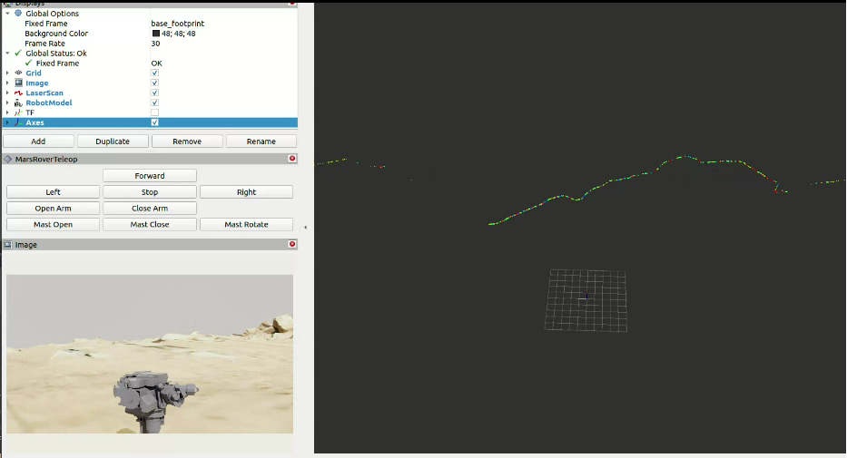

# Mars Rover Demo for Nvidia ISAAC

This pacakge reconfigures the controllers implemented in **mars_rover** package into separate controllers and adds a controller loader to load the configuration from the **config > isaac_mars_rover_control.yaml** file in the config folder. The list of supported controllers is mentioned in the **config > isaac_controller_loader_config.yaml** file

To run the demo with NVIDIA ISAAC, following steps need to be followed:

1. **build.sh** script will create a docker image with name **openrobotics/space_robots_demo**

2. To enable execution of UI applications in the container, execute the following command on the host PC:
  ```bash
  xhost +
  ```
3. Create a container from the docker image created in step 1, using the following command:
  ```bash
  docker run -it --env="DISPLAY=$DISPLAY" --env="QT_X11_NO_MITSHM=1" --volume="/tmp/.X11-unix:/tmp/.X11-unix:rw" --env="XAUTHORITY=$XAUTH" --volume="$XAUTH:$XAUTH" --net=host openrobotics/space_robots_demo bash
  ```  
4. Container will start in the directory **/home/spaceros-user/demo_ws**. 

5. Follow the setup instructions mendtioned in **src/simulation/curiosity_nvidia_isaac/README.md** to setup Nvidia ISAAC Simulation.

6. Once NVIDIA ISAAC is up and runnnig, execute the following commands (inside the container created in step 3) to run the demo
   ```bash
    cd /home/spaceros-user/demo_ws
    source install/setup.bash
    ros2 launch mars_rover_nvidia_isaac mars_rover_nvidia_isaac_launch.py
    ```
7. Above command will load all the supported controllers and launch RViz2 with the custom teleop plugin, camera window and LIDAR data enabled.
<p align="center">
  
</p>

8. At this point rover in Nvidia ISAAC simulation should move as per the tele-op command given and sensor data from ISAAC should be visible on RViz2