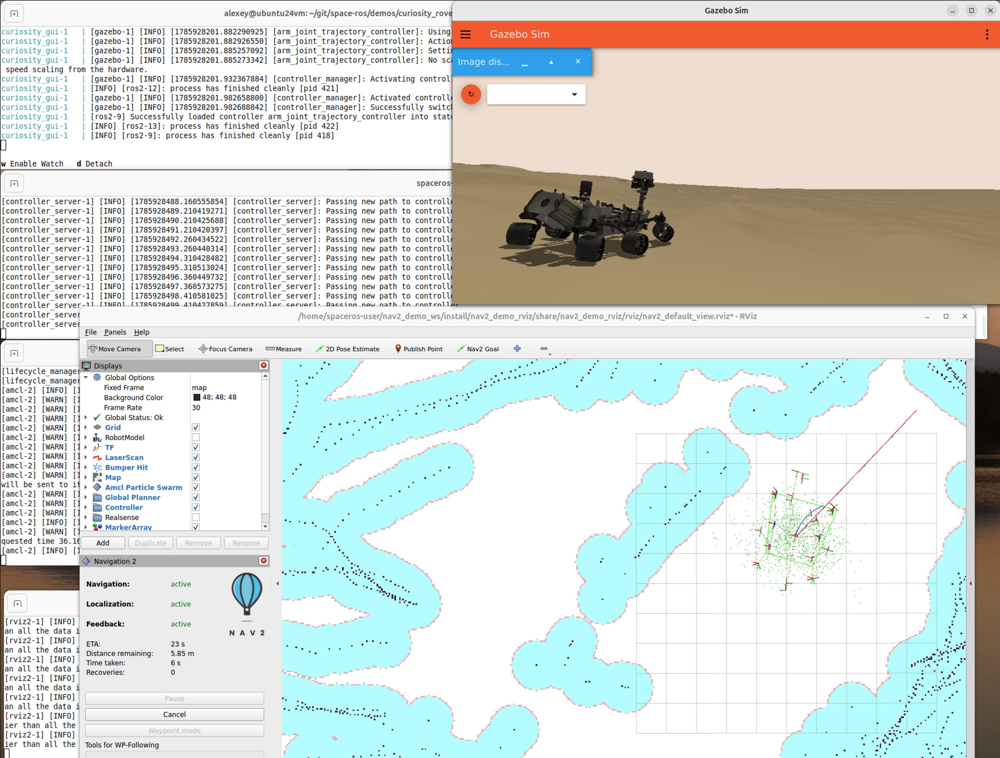

# Nav2 Curiosity Rover Demo

Run Nav2 localization and navigation against the [Curiosity rover](../curiosity_rover) Gazebo simulation.

This demo is a preliminary release; please file any issues found.

## Build

Build Curiosity (simulation + control) first, then this demo image:

```bash
cd ../curiosity_rover
./build.sh

cd ../nav2_demo
./build.sh
```

That produces `osrf/space-ros:curiosity_gui`, `osrf/space-ros:curiosity_demo`, and `osrf/space-ros-nav2-demo:latest`.

## Run

Allow Docker to use the host display:

```bash
xhost +local:docker
```

Start components in order. Curiosity must be running (and Gazebo playing) before Nav2, so `/clock`, odometry TF, and `/scan` are available.

### Terminal 1 — Curiosity (Gazebo + rover control)

```bash
cd ../curiosity_rover
./run.sh
```

In Gazebo, click **Play**.

### Terminal 2 — Nav2 navigation

```bash
cd ../nav2_demo
./run.sh
```

Inside the container:

```bash
ros2 launch space_ros_nav2_bringup navigation_launch.py use_sim_time:=True params_file:=nav2_params.yaml
```

Leave this running.

### Terminal 3 — Localization + map

```bash
docker exec -it osrf_space-ros-nav2-demo bash
```

```bash
ros2 launch space_ros_nav2_bringup localization_launch.py use_sim_time:=True map:=mars_map.yaml params_file:=nav2_params.yaml
```

(`./run.sh` already sources the workspace via the image entrypoint.)

### Terminal 4 — RViz

```bash
docker exec -it -e DISPLAY osrf_space-ros-nav2-demo bash
```

```bash
ros2 launch nav2_demo_rviz rviz_launch.py
```

If OpenGL is unreliable (for example in a VM), use software rendering:

```bash
LIBGL_ALWAYS_SOFTWARE=1 ros2 launch nav2_demo_rviz rviz_launch.py
```

## Localize and send a goal

1. In RViz, use **2D Pose Estimate** — place an arrow pointing up near the center of the grid.
2. Wait for Nav2 to initialize and for the costmaps to appear.
3. Use the **Nav2 Goal** tool to send a goal.

You should see something like this:

