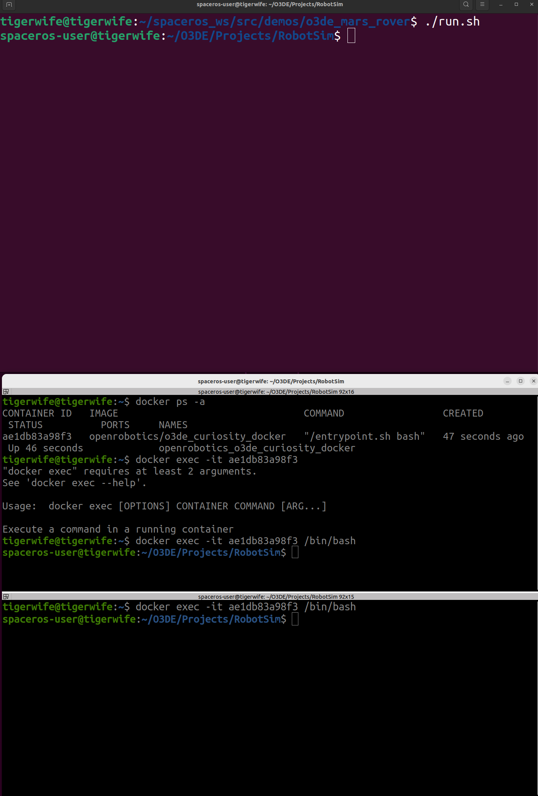
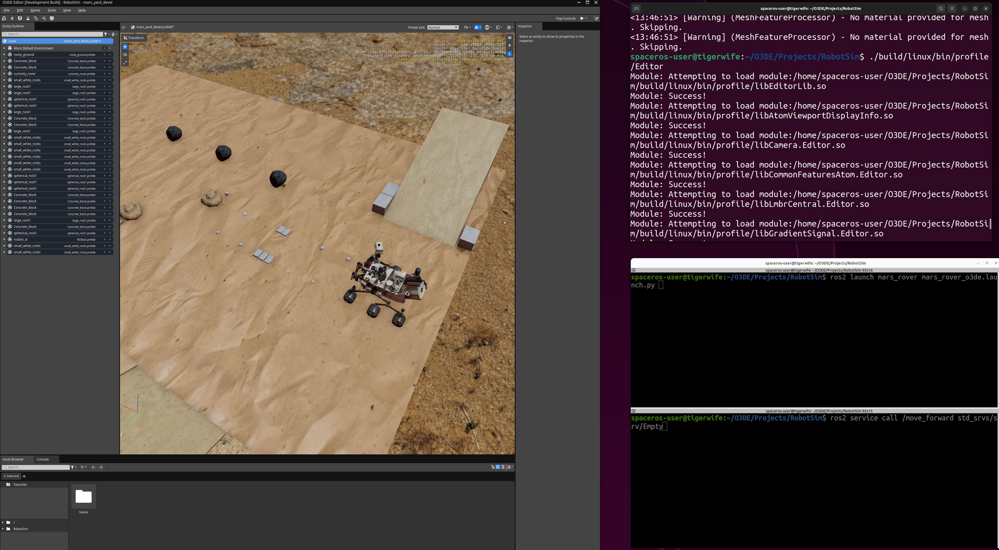

# o3de_mars_rover

This directory contains the Dockerfile instructions for creating the ```TODO``` image that showcases Curiosity rover navigating through a clutterd test environment inspired by JPL's Mars Yard testing ground.

Author: Azmyin Md. Kamal
Version: 1.0
Date: 09/09/2024
Landing page: **TODO** after submission. This page will always have the most updated information.

Version 1: This project was created as a submission to the NASA Space ROS Sim Summer Sprint Challenge 2024. A short review on O3DE, a small video showing the system in action and other related discussion can be found in this [PR](https://github.com/space-ros/demos/pull/64). In this submission only forward movement is supported.

## Prerequisits

* ```osrf/space-ros```. I will eventually upgrade the Dockerfile to use the ```openrobotics/moveit2::latest``` from [space-ros/docker/movit2](https://github.com/space-ros/docker/tree/main/moveit2) image

## Build instruction

**WARNING** At least have 60 GB of free disk space and since it builds Moveit2 and Demo_ws before building the whole O3DE project, expect at least 3 - 4 hours for the build process to complete.

* Git clone the top level ```demos``` repository and ```change directory``` into it. If you are just interested in the image, you don't need to clone this repo. Then from a terminal

```bash
cd /o3de_mars_rover
./build.sh
```

* Install Nvidia Container toolkit and run configuration as discussed here: https://docs.nvidia.com/datacenter/cloud-native/container-toolkit/latest/install-guide.html. If you don't have it open a terminal and do the following

* Make sure you have --runtime nvidia configured. If not this sample example will do it: ```sudo docker run --rm --runtime=nvidia --gpus all ubuntu nvidia-smi```

## Run the demo

* Use ```docker ps -a``` to check if you have a container running ```openrobotics/o3de_curiosity_docker``` running. A useful command that stops and removes all containers is ```docker rm $(docker ps -aq)```

We will need three terminals. Lets call them Termianls A, B and C respectively.

* Terminal A, run the following

```bash
xhost +local:docker
./run.sh
```

* Terminal B, find container id and then attach it

```bash
docker ps -a
docker exec -it <container_id> /bin/bash
```

* Terminal C, attach it to container

```bash
docker exec -it <container_id> /bin/bash
```

You should see the following setup



* In Terminal A, launch the O3DE app: ```./build/linux/bin/profile/Editor```

* Hit the play button (right arrow symbol top right)

* **IMOPRTANT** in Game mode, the mouse dissappears. To get it back , hit ```Ctrl+TAB``` keys.

* In Terminal B and C, first source DEMO_WS: ```source $DEMO_DIR/install/setup.bash```
* In Terminal B: ```ros2 launch mars_rover mars_rover_o3de.launch```
* In Terminal C: ```ros2 service call /move_forward std_srvs/srv/Empty```

If you did eveything correclty, you should see the following



Now the rover will move forward.
