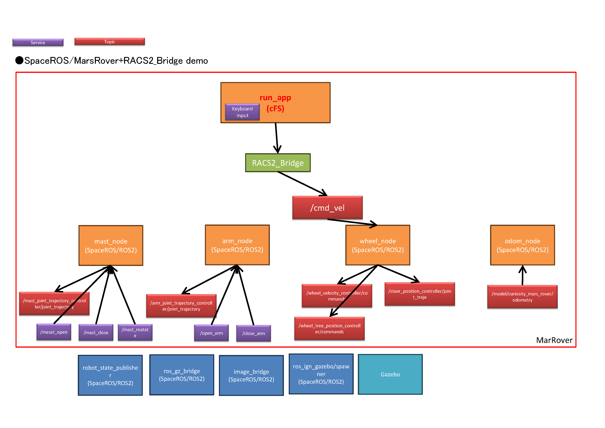

# RACS2 on Space ROS and Space Robots Demo Docker Image

The RACS2 on Space ROS and Space Robots Demo docker image uses the space_robots demo docker image (*openrobotics/space_robots_demo:latest*) as its base image.
Build instructions for that image can be found in [this README](../space_robots/README.md).
The Dockerfile installs all of the prerequisite system dependencies along with the demos source code, then builds the Space ROS Space Robots and RACS2 demo.

This is RACS2 Bridge demo for Curiosity Mars rover.

## Building the Demo Docker

This demo builds on top of the [`space-ros`](https://github.com/space-ros/space-ros), [`moveit2`](https://github.com/space-ros/docker/tree/main/moveit2), and [`space_robots`](https://github.com/space-ros/docker/tree/main/space_robots) Docker images.

To build the RACS2 demo image, follow these steps:

```bash
git clone https://github.com/space-ros/docker.git
cd docker/moveit2
./build.sh
cd ../space_robots
./build.sh
cd ../../demos/racs2_demos_on_spaceros
./build.sh
```

The final step builds the racs2_demos_on_spaceros image using the base images built in the previous steps.

Make sure you have Docker installed and sufficient permissions to run it (sudo may be required depending on your setup).

## Running the Demo Docker

(at /path/to/demos/racs2_demos_on_spaceros/docker/racs2_demos_on_spaceros)
run the following to allow GUI passthrough:
```bash
xhost +local:docker
```

Then run:
```bash
./run.sh
```

Depending on the host computer, you might need to add/remove the ```--gpus all``` flag in ```run.sh```, which uses your GPUs.

## Running the Demos

### Curiosity Mars rover demo
Launch the rover demo (calling Terminal 1):
```bash
source install/setup.bash
ros2 launch curiosity_rover_demo mars_rover.launch.py
```

#### RACS2 Bridge demo

##### Running racs2 bridge node
Open a new terminal (calling Terminal 2) and attach to the currently running container:

```bash
docker exec -it <container-name> bash
source install/setup.bash
ros2 run bridge_py_s bridge_py_s_node  --ros-args --params-file ./src/bridge_py_s/config/params.yaml
```

##### Running cFS bridge app & run_app app
Open a new terminal (calling Terminal 3) and attach to the currently running container:

```bash
docker exec -it <container-name> bash
cd ~/racs2_ws
cd cfs/build/exe/cpu1/
./core-cpu1
```

**Executing commands to the rover must be done with this terminal active.**

##### Available Commands

Drive commands to the rover are input via keyboard in Terimnal 3. The keymap is as follows.

* "w": Drive the rover forward
* "s": Drive the rover backward
* "a": Turn left
* "d": Turn right
* "x": Stop the rover

##### Nodes



## Reference

* [RACS2 bridge project by Japan Aerospace Exploration Agency (JAXA)](https://github.com/jaxa/racs2_bridge) 

* [Hiroki Kato and Tatsuhiko Saito, "RACS2: the ROS2 and cFS System - launched" Flight Software Workshop 2023.](https://drive.google.com/drive/folders/1C9fokWGDl2e4NfgX_ZU3f98FfPe9udwQ)

* [Hiroki Kato and Tatsuhiko Saito, "ROS and cFS System (RACS): Easing Space Robotic Development post-opensource activities and ROS2 integration" Flight Software Workshop 2021.](https://drive.google.com/file/d/11L48doT_pRNs7R0hdChPALqJO849TvV2/view?usp=drive_web)
