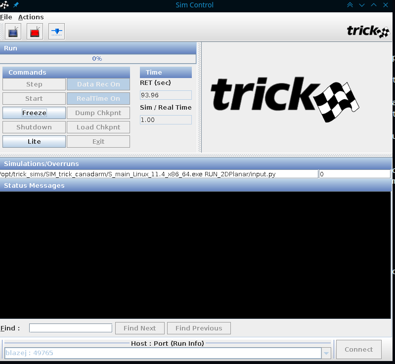
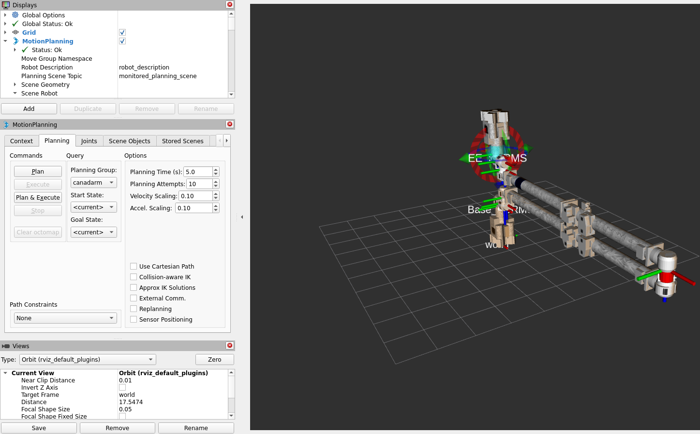
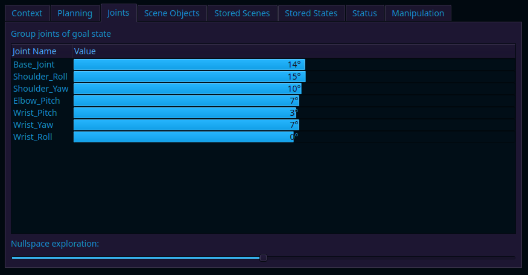
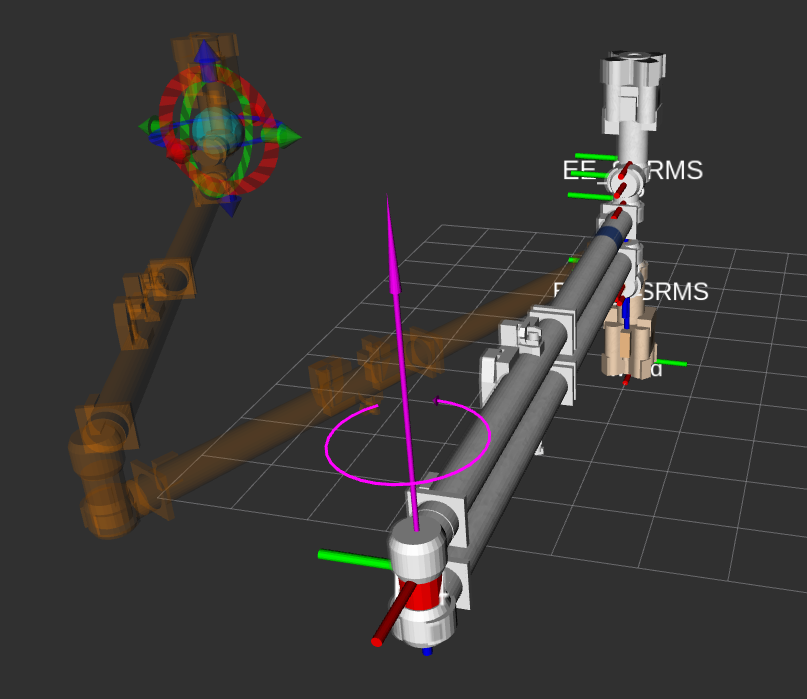
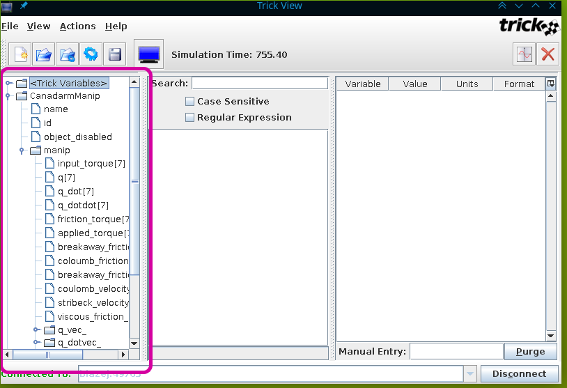
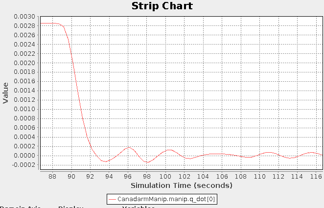
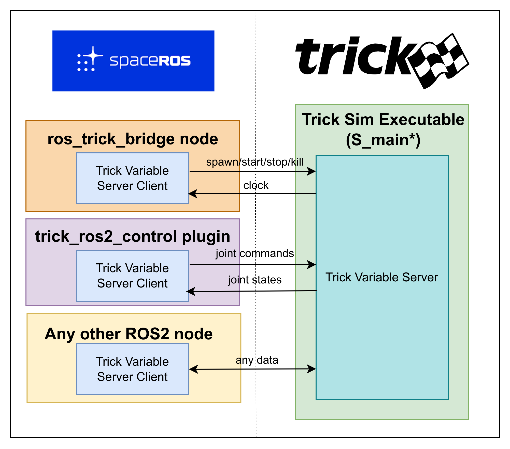

# NASA Space ROS Sim Summer Sprint Challenge

   Team lead freelance username: xfiderek  
   Submission title: Improving fidelity of SSRMS demo with Trick

# Improving fidelity of SSRMS demo with Trick (Moveit2 - canadarm2 - Trick demo)

This folder features an end-to-end demo of canadarm2 (SSRMS) modelled using [Trick](https://nasa.github.io/trick/) and connected to moveit2 via authored ROS2<>Trick bridge.

The demo includes the following:

1. [ros_trick_bridge](./ros_src/ros_trick_bridge/) - A ROS2 package allowing spawning & controlling trick simulations from ROS2 launch. It also sends /clock messages from trick to ROS2.
1. [trick_ros2_control](./ros_src/trick_ros2_control) - A ROS2 Control plugin that enables communication between ros2_control-enabled robots and trick simulations.
1. [SIM_trick_canadarm](./trick_src/SIM_trick_canadarm) - A trick simulation of canadarm demo running at 100Hz. The simulation calculates forward dynamics with Articulated Body Algorithm, with friction model that takes into account Stribeck effect.
1. Demo-related packages with moveit configurations, visualization, launch files and additional utils.
1. Dockerfiles and compose file launching an end to end canadarm demo

Both `ros_trick_bridge` and `trick_ros2_control` can be easily imported into any project that wants to leverage connection between trick and ROS2. Any type of data can be exchanged between two systems in the provided framework. Further sections in the readme describe how to adjust the provided code to other types of robots and simulations.

## Starting the demo

The demo environment runs Trick simulation of canadarm2 (SSRMS), connected to moveit2 via authored `ros_trick_bridge` node and `trick_ros2_control` plugin. Trick is used for modelling dynamics of SSRMS using Articulated Body Algorithm, taking Stribeck effect into account for friction forces. Joint Trajectory Controller from ROS2 control package is used to convert trajectory points into torque commands using PID controller. Additionally, the demo features Wrench visualizer, that subscribes to trick data to visualize joint torques in RVIZ.

Prerequisites - docker, docker compose

1. Build docker images in this folder:

    ```bash
    ./build.sh
    ```

    If building for the first time, this will clone the [space-ros/docker](https://github.com/space-ros/docker.git) repo from the `humble-2024.07.0` branch, due to dependency on canadarm assets and rviz2

1. Start containers:

    ```bash
    xhost +local:docker
    ./run.sh
    ```

    This should start two docker containers - one for Trick and another for ROS part.  
    You should now be able to see the Trick GUI:  
    

1. Login to the container with ROS part to open RVIZ

    ```bash
    docker exec -it canadarm_ros_trick_demo bash
    ```

    In the container:

    ```bash
    source install/setup.bash && ros2 launch trick_canadarm_moveit_config moveit_rviz.launch.py
    ```

    (Optional) If rviz does not render with the previous command, try overriding mesa loader driver:

    ```bash
    export MESA_LOADER_DRIVER_OVERRIDE=softpipe
    source install/setup.bash && ros2 launch trick_canadarm_moveit_config moveit_rviz.launch.py
    ```

    
1. From Rviz, Set target pose for canadarm with `Motion Planning` GUI. You can set target in joint space in `Motion Planning->Joints` tab. Set similar values to those below for reproducibility:

    
1. In `MotionPlanning` RVIZ Moveit GUI, go to `Planning` and hit `Plan & Execute`
1. You should be able to see magnitudes of torques applied to joints (pink arrows)  
    

*Note that the displayed torque values are `total_torque = input_torque - friction_torque`, thus they may dissapear shortly after starting execution, because arm operates in no-gravity environment and input and friction torques are close to each other after start. Friction torques can be visualized by changing topics in RVIZ to `/wrench_topic/{joint_name}/friction_torque` (e.g. `/wrench_topic/B1/friction_torque`) and bumping torque arrow scale to 1.0.*

*PID coefficients were manually tuned to ensure smooth movement, however as robot dynamics is quite sensitive, additional tuning may be required to achieve optimal / energy efficient trajectory execution*

### Plotting sim data with Trick

You can plot simulation data using `Trick View` application. Trick View is automatically started together with docker containers. To plot the data, simply open the GUI and navigate to `CanadarmManip.manip` in Trick Variables tree.

  



## Architecture of ROS2 Trick bridge

The main design goal was to make it easy to integrate existing trick simulations with ROS2 with no code changes on Trick side. That is the communication happens over [Trick Variable Server](https://nasa.github.io/trick/tutorial/TutVariableServer).



There are two ROS2 packages provided in the solution that interact directly with Trick:

1. `ros_trick_bridge` - this package contains a lifecycle (managed) node that spawns the trick simulation with proper parameters as a subprocess. Managed node transitions (active/inactive) can be used to start and pause the simulation. Additionally, the node subscribes to clock data from trick using Trick Variable Server and publishes it on ROS2 /clock topic.
1. `trick_ros2_control` - this is an optional package that can be used to quickly integrate ros2_control-enabled robots with trick. It uses a separate Trick Variable Server Client to exchange command and state data with the simulation.

Additionally, any other ROS2 node can be easily adjusted in provided framework to exchange any data with trick, using the provided primitives.

## Bridging ROS2 and Trick in your own project

The bridge and related components can be easily reused either natively or in docker-based environment. First, the native part will be described as it highlights how to configure the provided components to run with other simulations.

### Integrating Trick simulation with ROS2 using ros_trick_bridge

To run and control your simulation as ros node and publish /clock messages:

1. install trick on your target machine
1. Compile your simulation with [trick-CP](https://nasa.github.io/trick/tutorial/ATutAnalyticSim#trick-cp)
1. copy/include [ros_src/ros_trick_bridge](./ros_src/ros_trick_bridge/) into your ROS2 workspace.
1. Create simulation-specific param file from [ros_trick_bridge_example_params.yaml](ros_src/ros_trick_bridge/params/ros_trick_bridge_example_params.yaml) template.
1. Include the provided [ros_trick_bridge.launch.py](ros_src/ros_trick_bridge/launch/ros_trick_bridge.launch.py) in your project's bringup launch file.
1. Now the trick simulation should start together with your launch file and `/clock` messages should be published

The first 3 steps are handled in the provided docker images

### Using ros2_control with trick_ros2_control

Additionally, to use trick_ros2_control to control your robot with ROS2 control:

1. copy/include [ros_src/trick_ros2_control](ros_src/trick_ros2_control) into your ROS2 workspace
1. Define trick-related variables in your robot's URDF file as in canadarm [SSRMS_Canadarm2.ros2_control.xacro](ros_src/trick_canadarm_moveit_config/config/SSRMS_Canadarm2.ros2_control.xacro). For every joint interface, define corresponding trick variable. For example, assuming that your Base_Joint's position in trick is defined as `CanadarmManip.manip.q[0]` then add the following:

```xml
<joint name="Base_Joint">
    <state_interface name="position"/>
    <param name="state_interface/position/trick_variable_name">CanadarmManip.manip.q[0]</param>
</joint>
```

See [SSRMS_Canadarm2.ros2_control.xacro](./ros_src/trick_canadarm_moveit_config/config/SSRMS_Canadarm2.ros2_control.xacro) for reference.
Note that currently, initial positions are set via trick simulation. Initial commands are set to 0

### Exchange any other type of data (pub/sub) between trick and ros2

* (Python) There is a TrickVariableServerClient class provided as part of ros_trick_bridge. Check [canadarm_wrench_publisher_node.py](ros_src/canadarm_wrench_publisher/canadarm_wrench_publisher/canadarm_wrench_publisher_node.py) for example usage.
* (C++) - Take a look at Socket class and utils.hpp in ros2_trick to create your own node to exchange data

### Using provided docker images as starting point

The project was split into two docker images, so that the standalone ros trick bridge could be easily carved out and used in different projects.

1. [ros_trick_bridge.Dockerfile](./ros_trick_bridge.Dockerfile) featuring:

* Trick simulation enviroment
* `ros_trick_bridge` ros package with default parameters
* Example trick simulation code (canadarm simulation) from `trick_src` folder

1. [canadarm_trick_demo.Dockerfile](./canadarm_ros_trick_demo.Dockerfile) featuring:

* `trick_ros2_control`, containing ROS2 control plugin.
* `canadarm_moveit_config` package, starting moveit2 and ROS2 control.
* `canadarm_wrench_publisher` package, containing sample node that publishes Wrench data from trick

The files can be adjusted easily to facilitate docker-based development.
