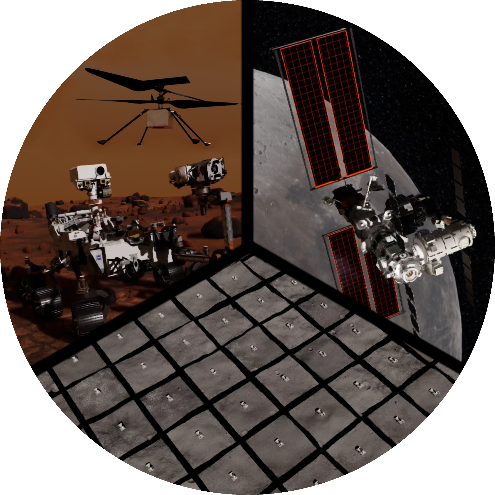

# Space ROS ProcGen Environments

The `spaceros_procgen_envs` package provides a set of procedurally generated environments with the goal of bridging the gap between simulated robots and the vast diversity of unpredictable space.



## Documentation

The full documentation is available in its raw form inside the [`docs`](docs/src) directory. Furthermore, it is hosted [online](https://AndrejOrsula.github.io/spaceros_demos) in a more accessible format.

<a href="https://AndrejOrsula.github.io/spaceros_demos"> </a>

## License

This demo is licensed under the [Apache 2.0](LICENSE) license.

All assets generated from the included procedural pipelines are licensed under the [CC0 1.0 Universal](LICENSE) license.

<a href="https://creativecommons.org/publicdomain/zero/1.0"></a>

______________________________________________________________________

```
Challenge Name:   NASA Space ROS Sim Summer Sprint Challenge
Freelancer Name:  AndrejOrsula
Submission Title: Parallel ProcGen Environments
```
