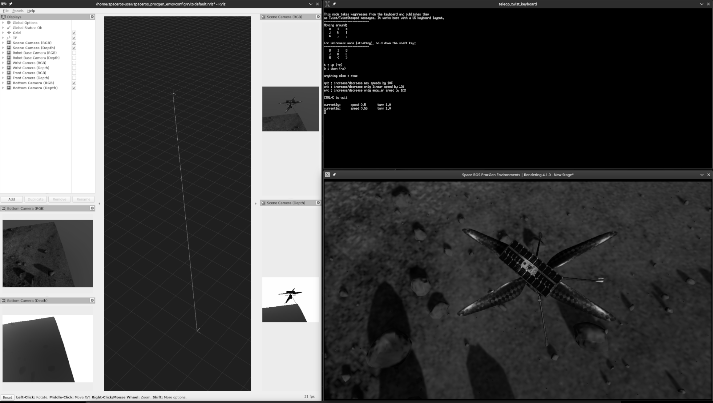

# Space ROS Integration

After understanding the [basic usage](usage.md) and running [parallel environments](parallel_envs.md), we now explore how to integrate these environments with Space ROS, enabling control of the robots and data collection over ROS topics.

## Single Environment

The `run_spaceros.py` script is the primary entry point for interfacing with the environments through Space ROS. This script spawns a single ROS node that maps inputs and outputs for the environment and provides miscellaneous functionalities such as resetting the simulation. Here is an example using the Ingenuity demo:

```bash
spaceros_procgen_envs/run.sh ros2 run spaceros_procgen_envs run_spaceros.py --demo ingenuity
```

Once the environment is initialized, open a new terminal to inspect the available ROS topics. You can either use your ROS setup or join the running Docker container with the `join.sh` script:

```bash
spaceros_procgen_envs/join.sh
```

Now, list the available ROS topics:

```bash
ros2 topic list
# Expected output:
# /clock
# /env/info
# /env/reward
# /env/terminated
# /env/truncated
# /parameter_events
# /robot/cmd_vel
# /rosout
# /tf
```

To control the robot, publish a `Twist` message to the `/robot/cmd_vel` topic:

```bash
ros2 topic pub --once /robot/cmd_vel geometry_msgs/msg/Twist '{linear: {x: 1.0}}'
```

You can reset the simulation by calling the `/sim/reset` service:

```bash
ros2 service call /sim/reset std_srvs/srv/Empty
```

## Parallel Environments

You can run multiple environments in parallel by using the `--num_envs` argument. Each environment will map to its own ROS namespace. For example, try running the Ingenuity demo with 4 environments:

```bash
spaceros_procgen_envs/run.sh ros2 run spaceros_procgen_envs run_spaceros.py --demo ingenuity --num_envs 4
```

List the available ROS topics again:

```bash
ros2 topic list
# Expected output:
# /clock
# /env0/reward
# /env0/robot/cmd_vel
# /env0/terminated
# /env0/truncated
# /env1/reward
# /env1/robot/cmd_vel
# /env1/terminated
# /env1/truncated
# /env2/reward
# /env2/robot/cmd_vel
# /env2/terminated
# /env2/truncated
# /env3/reward
# /env3/robot/cmd_vel
# /env3/terminated
# /env3/truncated
# /envs/info
# /envs/robot/cmd_vel
# /parameter_events
# /rosout
# /tf
```

Each environment has its own namespace, allowing individual control. For example:

```bash
ros2 topic pub --once /env0/robot/cmd_vel geometry_msgs/msg/Twist '{linear: {x: -1.0}}'
ros2 topic pub --once /env1/robot/cmd_vel geometry_msgs/msg/Twist '{linear: {x: 1.0}}'
ros2 topic pub --once /env2/robot/cmd_vel geometry_msgs/msg/Twist '{linear: {y: -1.0}}'
ros2 topic pub --once /env3/robot/cmd_vel geometry_msgs/msg/Twist '{linear: {y: 1.0}}'
```

## Launch with `rviz2` and `teleop_twist_keyboard`

For convenience, you can launch `rviz2` alongside `run_spaceros.py` and `teleop_twist_keyboard` for visualization and control via keyboard:

```bash
spaceros_procgen_envs/run.sh ros2 launch spaceros_procgen_envs demo.launch.py task:=ingenuity_visual num_envs:=4
```


