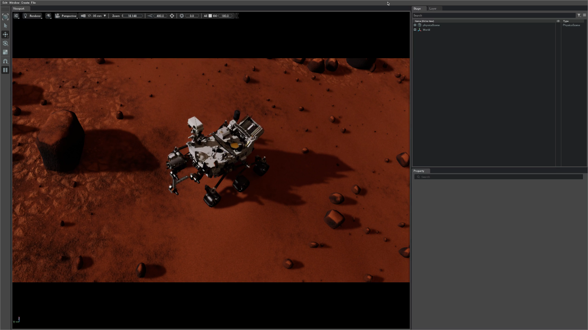
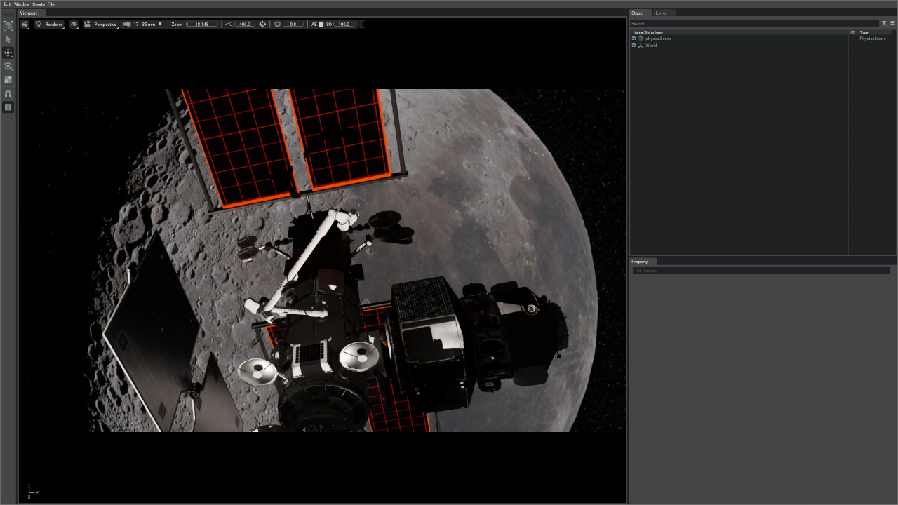

# Basic Usage (Docker)

After successfully [building the Docker image](../getting_started/installation.md#4-build-the-docker-image), you are ready to run the environments provided by this demo. The sections below will guide you through this process using a simple teleoperation demo.

It is strongly recommended that you always use the provided `run.sh` script when interacting with `spaceros_procgen_envs`. This script configures the environment automatically and mounts caching volumes. The source code of the demo is also mounted as a volume, which allows you to make code changes in either the host or the container while retaining them. You can optionally provide a command that will be executed immediately inside the container. If no command is specified, you will be dropped into an interactive shell by default. Throughout this documentation, if you omit the `spaceros_procgen_envs/run.sh` prefix, it assumes that you are already inside the Docker container.

```bash
spaceros_procgen_envs/run.sh ${OPTIONAL_CMD}
```

## Verify the Functionality of Isaac Sim

Let's start by verifying that Isaac Sim is functioning correctly:

<div class="warning">
The first time Isaac Sim starts, it may take a few minutes to compile shaders. However, subsequent runs will use cached artefacts, which significantly speeds up the startup.
</div>

```bash
# Single quotes are required for the tilde (~) to expand correctly inside the container.
spaceros_procgen_envs/run.sh '~/isaac-sim/isaac-sim.sh'
```

If any issues arise, consult the [Troubleshooting](../misc/troubleshooting.md#runtime-errors) section or the [official Isaac Sim documentation](https://docs.omniverse.nvidia.com/isaacsim), as this issue is likely unrelated to the demo.

## Journey into the Unknown

Once Isaac Sim is confirmed to be working, you can begin exploring the demos and tasks included with the environments. Let's start with a simple teleoperation demo:

```bash
spaceros_procgen_envs/run.sh ros2 run spaceros_procgen_envs teleop.py
```

After a few moments, Isaac Sim should appear. The window will briefly remain inactive as the assets are procedurally generated in the background. The generation time depends on the complexity of the assets and your hardware, particularly the GPU, which will be used to bake PBR textures. However, future runs will use cached assets, as long as the configuration remains unchanged and the cache is not cleared (see the [clean_cache.md](clean_cache.md)).

Eventually, you will be greeted by the Mars Perseverance Rover on a procedurally generated Martian landscape.



At the same time, the terminal will display the following keyboard scheme:

```
                  +------------------------------------------------+
                  |  Keyboard Scheme (focus the Isaac Sim window)  |
                  +------------------------------------------------+
                  +------------------------------------------------+
                  | Reset: [ L ]                                   |
                  +------------------------------------------------+
                  | Planar Motion                                  |
                  |                     [ W ] (+X)                 |
                  |                       ↑                        |
                  |                       |                        |
                  |          (-Y) [ A ] ← + → [ D ] (+Y)           |
                  |                       |                        |
                  |                       ↓                        |
                  |                     [ S ] (-X)                 |
                  +------------------------------------------------+
```

While the Isaac Sim window is in focus, you can control the rover using the `W`, `A`, `S`, and `D` keys for motion. Use your mouse to navigate the camera. If the rover gets stuck, pressing `L` will reset its position.

To close the demo, press `Ctrl+C` in the terminal. This will gracefully shut down the demo, close Isaac Sim, and return you to your host environment.

### Increase the Simulation Fidelity

By default, the textures in the environment appear blurry due to the configuration setting the baked texture resolution to 12.5% (`default=0.125`). This setting allows procedural generation to be faster on low-end hardware. If your hardware is capable, you can increase the resolution by adjusting the `detail` parameter (see [environment configuration](configuration.md#environment-configuration)):

```bash
spaceros_procgen_envs/run.sh -e SPACEROS_DEMO_DETAIL=1.0 ros2 run spaceros_procgen_envs teleop.py
```

## Exploring More

You can explore other demos by using the `--demo`, `--task`, or `--env` arguments (which are interchangeable). A full list of available demos is found in the [overview](../overview/envs.md), or you can conveniently list them using this command:

```bash
spaceros_procgen_envs/run.sh ros2 run spaceros_procgen_envs list_envs.py
```

As an example, here is how you can launch a new demo:

```bash
spaceros_procgen_envs/run.sh ros2 run spaceros_procgen_envs teleop.py --demo <DEMO>
```


