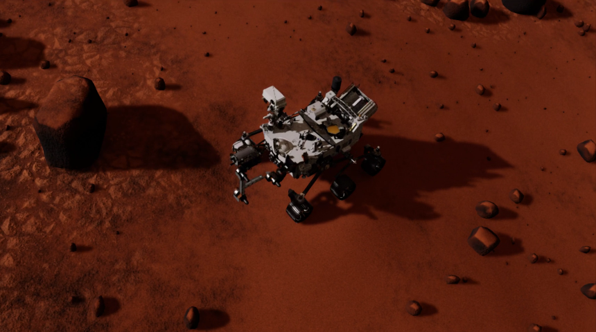
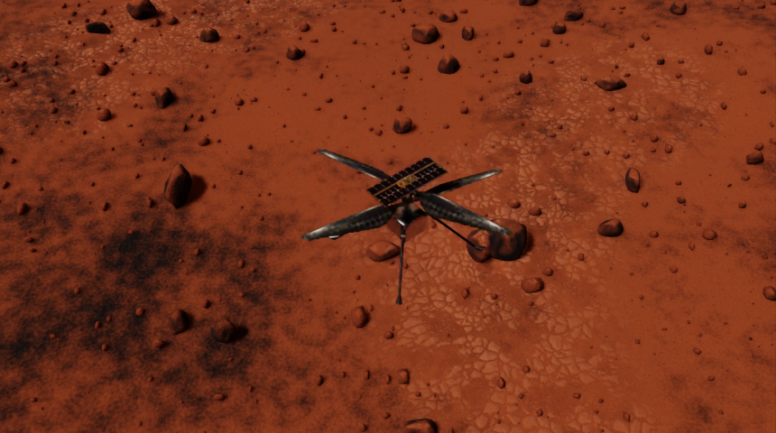
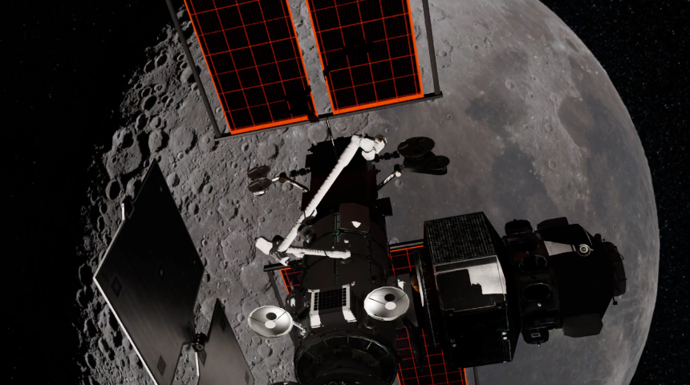
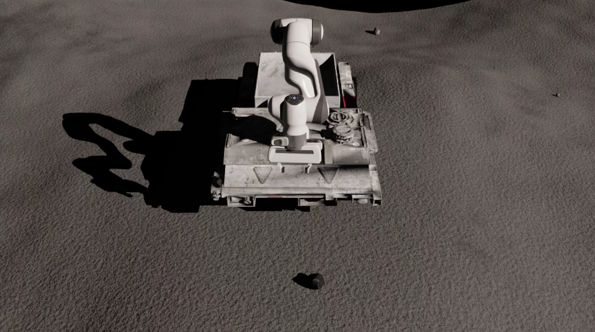
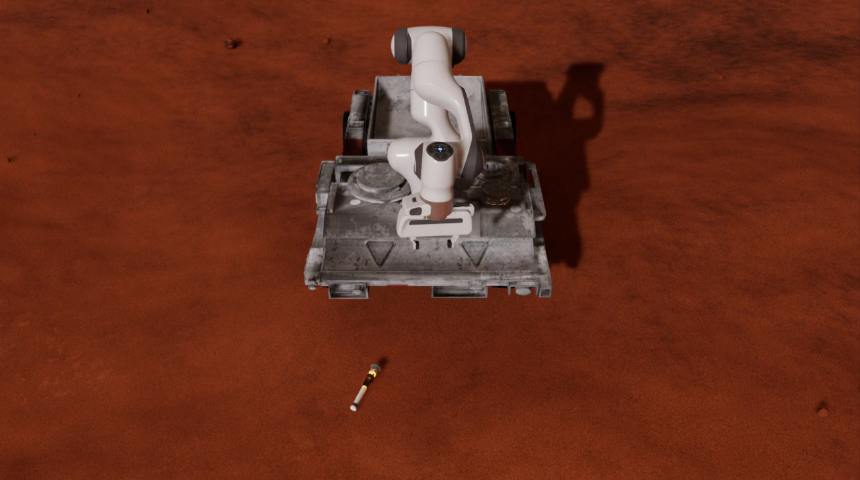
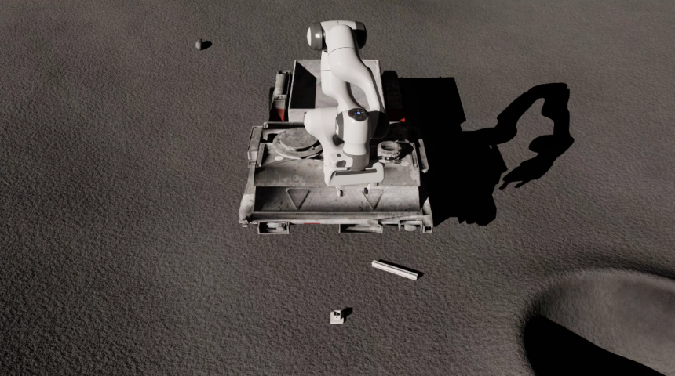
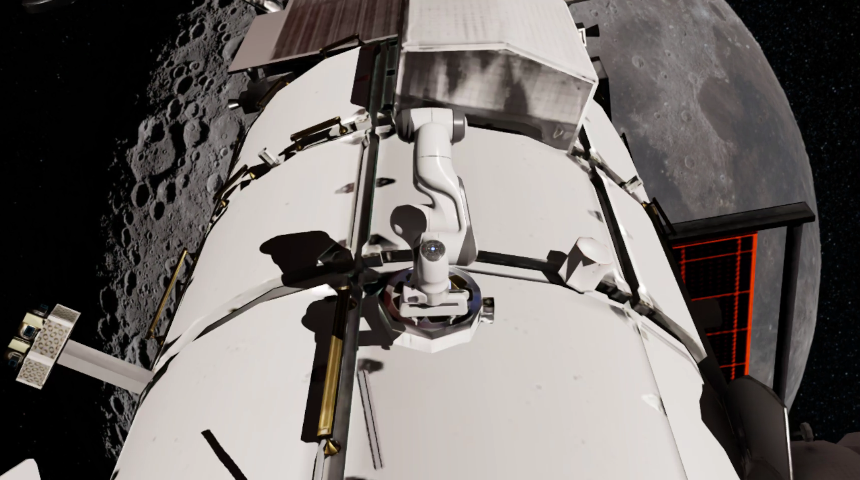

# Environments

This section provides an overview of the environments currently available in the `spaceros_procgen_envs` package.

Before using these environments, ensure that you meet the [system requirements](../getting_started/requirements.md) and have successfully installed the demo, as outlined in the [installation guide](../getting_started/installation.md). Once installation is complete, refer to the [usage instructions](../getting_started/usages.md) to learn how to run the environments.

## Demos

### Perseverance



```bash
spaceros_procgen_envs/run.sh ros2 run spaceros_procgen_envs teleop.py --demo perseverance
```

### Ingenuity



```bash
spaceros_procgen_envs/run.sh ros2 run spaceros_procgen_envs teleop.py --demo ingenuity
```

### Gateway



```bash
spaceros_procgen_envs/run.sh ros2 run spaceros_procgen_envs teleop.py --demo gateway
```

## Tasks

A set of environments that come with an objective for the robot to complete. Each environment instance provides a reward signal that agents must learn to maximize.

### Sample Collection (Moon/Mars)

#### Moon



```bash
spaceros_procgen_envs/run.sh -e SPACEROS_DEMO_SCENARIO=moon -e SPACEROS_DEMO_SCENARIO=procedural ros2 run spaceros_procgen_envs teleop.py --demo sample_collection
```

#### Mars



```bash
spaceros_procgen_envs/run.sh -e SPACEROS_DEMO_SCENARIO=mars -e SPACEROS_DEMO_SCENARIO=dataset ros2 run spaceros_procgen_envs teleop.py --demo sample_collection
```

### Peg-in-Hole (Moon/Mars/Orbit)



```bash
spaceros_procgen_envs/run.sh ros2 run spaceros_procgen_envs teleop.py --demo peg_in_hole
```

### Debris Capture (Orbit)



```bash
spaceros_procgen_envs/run.sh -e SPACEROS_DEMO_SCENARIO=dataset ros2 run spaceros_procgen_envs teleop.py --demo debris_capture
```

______________________________________________________________________

Note: All environments have two variants (e.g. `perseverance` and `perseverance_visual`) that differ in the enabled sensors. The `*_visual` variant includes camera sensors that provide visual observations at the cost of increased computational requirements.
